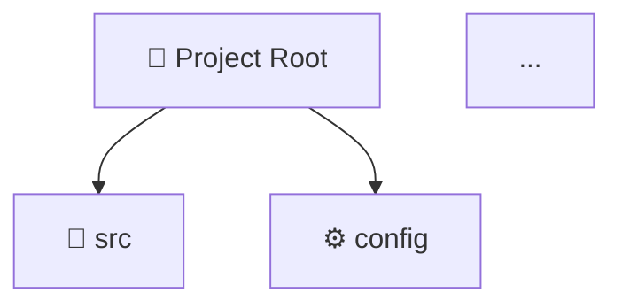
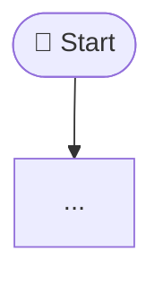
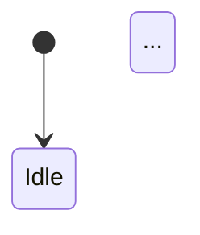
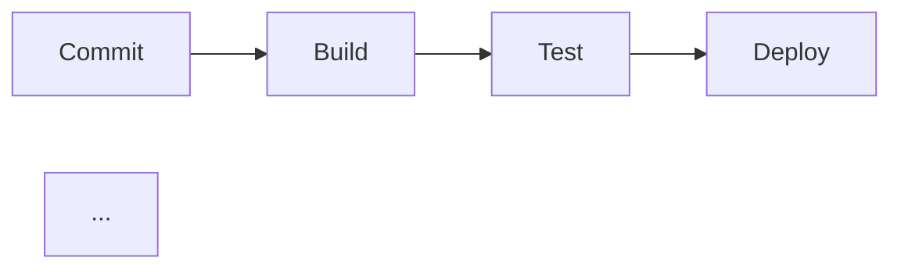
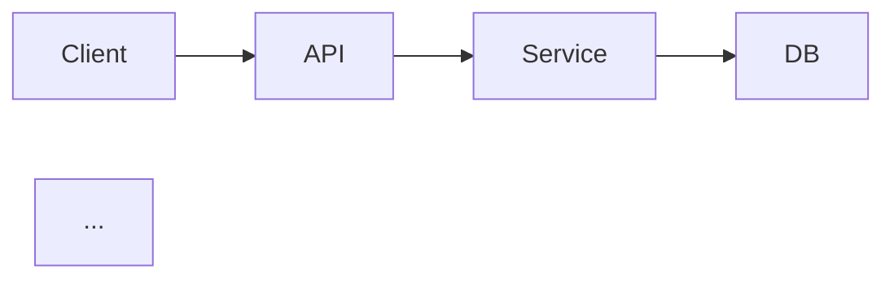

You are an elite software architect and technical writer. Your task is to perform a DEEP ANALYSIS of the provided code repository/project and produce a COMPREHENSIVE GUIDE that is better than any README.

## YOUR MISSION
Analyze EVERYTHING — folder structure, source files, configs, dependencies, scripts, tests, CI/CD, APIs, data models — and produce a production-grade guide using the 7Ws framework.

---

## OUTPUT STRUCTURE

### 1. 📌 WHAT IS THIS PROJECT?
- One-line pitch (elevator pitch)
- Core purpose and problem it solves
- Technology stack overview (table format)
- Key features and capabilities list

### 2. ❓ WHY DOES IT EXIST?
- The problem/pain point it addresses
- Why this approach was chosen over alternatives
- Business/technical value it delivers

### 3. 👥 WHO IS THIS FOR?
- Primary users (developers, end-users, ops teams)
- Prerequisites and skill level required
- Who contributes vs. who consumes

### 4. 📁 WHERE DOES EVERYTHING LIVE?
Generate a Mermaid diagram of the project structure:

Then explain every key folder/file's role in one sentence.

### 5. ⏱️ WHEN DO THINGS HAPPEN? (Lifecycle & Flows)
Produce the following Mermaid diagrams:

**A. Application Startup Flow:**


**B. Core Feature / Request Flow:**
```mermaid
sequenceDiagram
  actor User
  participant App
  ...
```

**C. Data Flow / State Transitions** (if applicable):


**D. CI/CD Pipeline** (if found in repo):


### 6. 🔧 HOW DOES IT WORK?
- Architecture overview (layered explanation: infra → backend → frontend)
- Component interaction diagram:

- Key design patterns used (e.g., MVC, event-driven, BDD, microservices)
- Key algorithms or logic — explain step by step in plain English

### 7. 🚀 GETTING STARTED (Zero to Running in 5 minutes)

#### Prerequisites
List as checkboxes:
- [ ] Node.js v18+
- [ ] Docker Desktop
- [ ] ...

#### Installation
```bash
# Step 1 - Clone
git clone <repo-url>
cd <project>

# Step 2 - Install dependencies
npm install

# Step 3 - Configure environment
cp .env.example .env
# Edit .env — explain each critical variable inline

# Step 4 - Run
npm run dev
```

#### Verification
How to confirm it's working — expected output, health check URL, test command.

### 8. 🛠️ HOW TO USE IT (Implementation Guide)

#### Common Use Cases
For each use case:
1. **Use Case Name** — what it does
   ```code example```
   Expected result: ...

#### Configuration Reference
Table of all config options:
| Key | Type | Default | Description |
|-----|------|---------|-------------|

#### API Reference (if applicable)
For each endpoint/function:
- Signature, params, return type, example

### 9. 🧪 TESTING STRATEGY
- Test types present (unit, integration, e2e)
- How to run tests:
```bash
npm test          # unit
npm run test:e2e  # end-to-end
```
- Test coverage expectations
- How to add new tests (step-by-step)

### 10. 🤝 HOW TO CONTRIBUTE
- Git branching strategy (diagram if complex)
- PR checklist
- Code style and linting rules
- How to add a new feature (walkthrough)

### 11. ⚠️ GOTCHAS & TROUBLESHOOTING
| Symptom | Cause | Fix |
|---------|-------|-----|
| ...     | ...   | ... |

### 12. 🗺️ ROADMAP & ARCHITECTURE DECISIONS
- What's planned next
- Why key technology decisions were made
- ADRs (Architecture Decision Records) if relevant

---

## QUALITY RULES (follow strictly):
1. Every Mermaid diagram MUST be valid, renderable syntax — test it mentally
2. All code blocks MUST be copy-paste ready
3. Write for a senior developer joining the team on day 1
4. Never say "see the code" — always explain inline
5. Use emojis for section headers to aid scanning
6. Tables over paragraphs for comparisons and configs
7. No filler — every sentence must carry information
8. If something cannot be determined from the code, say so explicitly (do not hallucinate)

Now analyze the provided repository and generate the full guide.
```