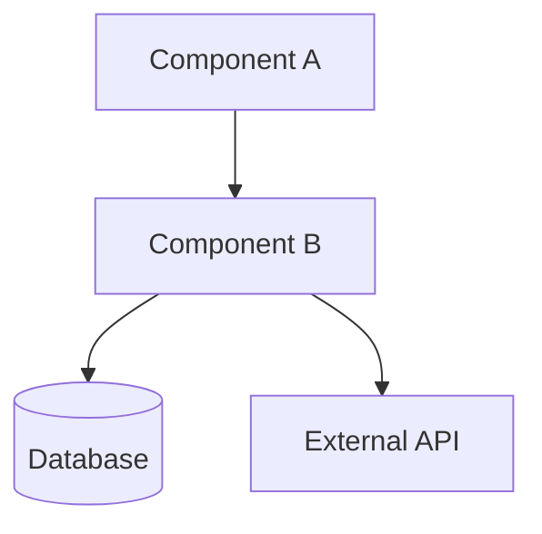
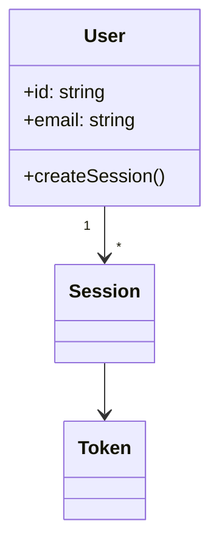
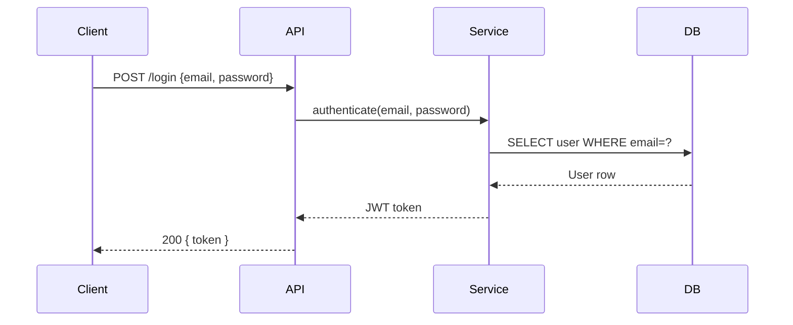
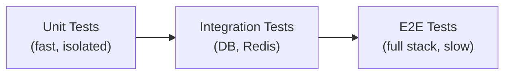
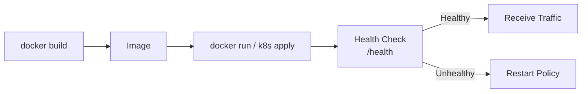

# Repo Guide Skill

Generate a comprehensive, opinionated developer guide for any project — better than any README.

---

## Phase 0 — Reconnaissance

Before writing a single word of the guide, do a thorough sweep of the repository.

### 0.1 — Map the filesystem

```bash
find . -type f | grep -v node_modules | grep -v .git | grep -v __pycache__ \
  | grep -v ".pyc" | sort | head -200
```

Also run:
```bash
# Get directory tree
find . -maxdepth 4 -type d | grep -v node_modules | grep -v .git | sort
```

### 0.2 — Read key discovery files first (in this order)

1. `package.json` / `pyproject.toml` / `Cargo.toml` / `go.mod` / `pom.xml` — dependencies + scripts
2. `README.md` / `README.rst` — existing docs (use as a baseline to EXCEED)
3. `docker-compose.yml` / `Dockerfile` — deployment shape
4. `.env.example` / `config/` — configuration surface
5. Main entry point (see §0.3)
6. Any `ARCHITECTURE.md`, `CONTRIBUTING.md`, `CHANGELOG.md`

### 0.3 — Find the entry point

| Stack | Look for |
|---|---|
| Node.js | `main` in package.json → that file |
| Python | `__main__.py`, `app.py`, `main.py`, `cli.py` |
| Go | `cmd/main.go` or `main.go` |
| Rust | `src/main.rs` |
| Java/Kotlin | Class with `public static void main` |
| React/Vue/Angular | `src/App.*`, `src/index.*` |
| Next.js | `app/page.tsx` or `pages/index.tsx` |
| Ruby/Rails | `config/routes.rb` + `app/` |

### 0.4 — Read the core logic

Read the 5–10 most important files: entry point, core modules, key services/controllers/handlers, main config, and any file referenced heavily by others.

---

## Phase 1 — The Guide Structure

Produce the guide as a **well-formatted Markdown document**. Use the exact section order below. Do not skip sections.

---

### SECTION 1 — Project Identity Card

```markdown
# [Project Name]
> [One-sentence tagline that captures the essence]

| Field        | Value |
|---|---|
| **Type**     | e.g. REST API / CLI tool / Web App / Library / Monorepo |
| **Language** | e.g. TypeScript 5.x |
| **Runtime**  | e.g. Node.js 20 / Python 3.11 |
| **License**  | e.g. MIT |
| **Status**   | e.g. Active / Experimental / Archived |
```

---

### SECTION 2 — What Is This? (The 60-Second Pitch)

Write 3–5 sentences answering:
- What problem does this solve?
- What does it do at a high level?
- Who uses it?
- What does it NOT do? (important scope boundary)

---

### SECTION 3 — Architecture Overview

Produce a **Mermaid architecture diagram** showing:
- Major system components (services, modules, layers)
- How they connect (data flow, API calls, queues)
- External dependencies (databases, third-party APIs, brokers)



Follow with 2–3 sentences describing the architectural style (e.g. layered, microservices, event-driven, MVC, functional pipeline) and key design decisions visible in the structure.

---

### SECTION 4 — Why Was It Built This Way?

For each major architectural decision, write a short entry:

```
**Decision: [e.g. "Used Redis for session storage instead of DB"]**
- Why: [rationale]
- Trade-off: [what was given up]
- Alternative considered: [if inferrable]
```

Aim for 3–6 decisions. If the codebase has no evident reasoning, infer from patterns (e.g. "The project avoids ORMs, preferring raw SQL — likely for performance control or to reduce dependencies").

---

### SECTION 5 — Project Structure (Annotated File Map)

```
project-root/
├── src/
│   ├── controllers/    # HTTP request handlers — thin, delegate to services
│   ├── services/       # Business logic — the core of the app
│   ├── models/         # Data types and DB schemas
│   └── utils/          # Shared helpers (no business logic)
├── tests/              # Unit + integration tests (mirrors src/ structure)
├── config/             # Environment-specific config, never commit secrets
├── Dockerfile          # Containerisation — multi-stage, build + runtime
└── package.json        # Scripts: start, dev, test, build
```

Every folder/file that matters gets a one-line comment. Skip auto-generated, vendor, and cache dirs.

---

### SECTION 6 — Core Concepts Explained

For each major concept in the codebase (e.g. "Jobs", "Pipelines", "Tenants", "Agents", "Hooks", "Middleware"), write:

**[Concept Name]**
- What it is (1 sentence definition)
- Where it lives in code (file path)
- How it's created/used (short code snippet if helpful)
- How it relates to other concepts

Use a **Mermaid entity-relationship or class diagram** here if there are 3+ related concepts:



---

### SECTION 7 — Data & Request Flows

Pick the **2–3 most important flows** in the system (e.g. "user login", "job processing", "file upload pipeline"). For each:

**Flow: [Name]**



Follow with a numbered step list that matches the diagram:
1. Client POSTs credentials
2. API validates input shape
3. Service checks credentials against hashed password
...

---

### SECTION 8 — Getting Started (Zero to Running)

This is the most important section for new developers. Be ruthlessly specific.

#### Prerequisites

List every prerequisite with minimum versions:
- Node.js >= 20.x
- PostgreSQL >= 15 (or Docker)
- [etc.]

#### Step-by-Step Setup

```bash
# 1. Clone the repository
git clone [repo-url]
cd [project-name]

# 2. Install dependencies
npm install   # or pip install -r requirements.txt, etc.

# 3. Configure environment
cp .env.example .env
# Edit .env — required vars are: [list them]

# 4. Set up the database (if applicable)
npm run db:migrate
npm run db:seed   # optional sample data

# 5. Start the development server
npm run dev

# 6. Verify it's working
curl http://localhost:3000/health
# Expected: {"status":"ok"}
```

#### Common Setup Failures

| Error | Cause | Fix |
|---|---|---|
| `ECONNREFUSED :5432` | Postgres not running | `docker-compose up db` |
| `MODULE_NOT_FOUND` | Deps not installed | `npm install` |
| [Infer others from config/code] | ... | ... |

---

### SECTION 9 — Configuration Reference

List every environment variable or config key:

| Variable | Required | Default | Description |
|---|---|---|---|
| `DATABASE_URL` | ✅ | — | Postgres connection string |
| `JWT_SECRET` | ✅ | — | Min 32 chars, used for signing tokens |
| `PORT` | ❌ | `3000` | HTTP server port |
| `LOG_LEVEL` | ❌ | `info` | One of: debug, info, warn, error |

---

### SECTION 10 — How to Use / Implement

#### If it's a library/SDK:

Provide 3 levels of usage — basic, intermediate, advanced — each as a copy-paste code snippet with inline comments.

#### If it's an API:

Document the 5 most important endpoints:

```
POST /api/v1/users
Authorization: Bearer <token>
Content-Type: application/json

{
  "email": "user@example.com",
  "name": "Alice"
}

→ 201 { "id": "usr_abc123", "email": "...", "createdAt": "..." }
```

#### If it's a CLI:

```bash
# Most common commands
project-name start --port 8080
project-name migrate --env production
project-name --help   # full command reference
```

#### If it's a frontend app:

Show the component hierarchy and the key interaction patterns.

---

### SECTION 11 — Testing

```bash
# Run all tests
npm test

# Unit tests only
npm run test:unit

# With coverage
npm run test:coverage
```

Describe what's tested, what's NOT tested, and any test fixtures/factories to know about.

Include a **test strategy diagram** if the project has multiple test layers:



---

### SECTION 12 — Deployment & Operations

#### Deployment Options

List all deployment methods available (Docker, Kubernetes, Heroku, Vercel, etc.) with their config files.

#### Production Checklist

```markdown
- [ ] Set NODE_ENV=production (or equivalent)
- [ ] Configure real DATABASE_URL
- [ ] Set strong JWT_SECRET / API keys
- [ ] Enable HTTPS / TLS termination
- [ ] Configure log aggregation
- [ ] Set memory/CPU limits in container
- [ ] Run db:migrate before starting
```

#### Lifecycle Diagram



---

### SECTION 13 — Who This Is For (Roles)

| Role | Relationship to this project | Where to start |
|---|---|---|
| **New Developer** | Needs to run it locally and contribute | Section 8 → Section 5 |
| **Integrator** | Calling the API / importing as a lib | Section 10 |
| **Ops / DevOps** | Deploying and operating | Section 12 |
| **Architect** | Understanding design | Sections 3–4 |
| **QA Engineer** | Testing strategy | Section 11 |

---

### SECTION 14 — Quick Reference Card

A single-page cheat sheet at the end. Summarize the most important commands, URLs, and concepts in a scannable grid.

```markdown
## Quick Reference

### Commands
| Task | Command |
|---|---|
| Start dev | `npm run dev` |
| Run tests | `npm test` |
| Build | `npm run build` |
| DB migrate | `npm run db:migrate` |

### Key URLs (local)
| Service | URL |
|---|---|
| App | http://localhost:3000 |
| API Docs | http://localhost:3000/docs |
| Health | http://localhost:3000/health |

### Key Concepts
[3–5 bullet definitions of the most important domain terms]
```

---

## Phase 2 — Output Instructions

### Format

- Output as **a single Markdown document** (or save as `GUIDE.md` if filesystem is available)
- Use H2 (`##`) for sections, H3 (`###`) for subsections
- Every Mermaid diagram must be fenced with ` ```mermaid `
- Code blocks must specify language for syntax highlighting
- Use tables for structured data, not nested bullets
- Keep prose tight — no filler, no padding

### Quality Gates — Before Finishing, Check:

- [ ] Every section is present (1–14)
- [ ] At least **3 Mermaid diagrams** included
- [ ] At least **1 sequence diagram** for a key flow
- [ ] Getting Started (§8) has exact commands that will actually work
- [ ] Configuration table (§9) is complete — no mystery variables
- [ ] File map (§5) covers every non-trivial directory
- [ ] Quick Reference Card (§14) is self-contained

### Tone

- Confident and direct — "This project does X" not "This project appears to do X"
- Practical — every explanation connects to something the reader will actually do
- No marketing fluff — no "powerful", "blazing-fast", "seamless" unless literally true
- Opinionated where helpful — "Start here, not there"

---

## Phase 3 — Edge Cases

### Monorepo

When the project is a monorepo (multiple packages under `packages/`, `apps/`, `services/`):
- Produce one master architecture diagram showing how the packages relate
- Produce one condensed guide per package (§§ 1, 5, 8, 10 only)
- Cross-link between guides

### Very Small Projects (< 5 files)

Still produce all 14 sections, but compress — combine §3+§4 into one, combine §5+§6 into one. Do not skip the diagrams.

### Very Large Projects (> 50 files)

- Focus §5 (file map) on top-level structure only; link to subdirectory READMEs if they exist
- For §6 (core concepts), focus on the top 5 most referenced concepts
- §7 (flows) — pick the single most important user-facing flow plus one internal/background flow

### Unknown or Obfuscated Code

If the code is minified, compiled, or otherwise unreadable:
- Document what CAN be inferred (config files, Dockerfile, package.json)
- Note explicitly: "Source code is not available in readable form — the following is inferred from build artifacts and configuration"

---

## Skill Notes

- **Save output**: If `file_create` / `bash_tool` is available, save as `GUIDE.md` in the project root and present it. Otherwise render inline.
- **Ask before starting** only if: (a) the user has provided no files at all, or (b) the project is ambiguous (e.g. two unrelated codebases merged). Otherwise start immediately.
- **Do not ask** "Which sections do you want?" — produce the full guide, then offer to expand any section.
- When the guide is done, end with: *"Guide complete. Sections you might want to expand: [2–3 specific suggestions based on what you found]."*