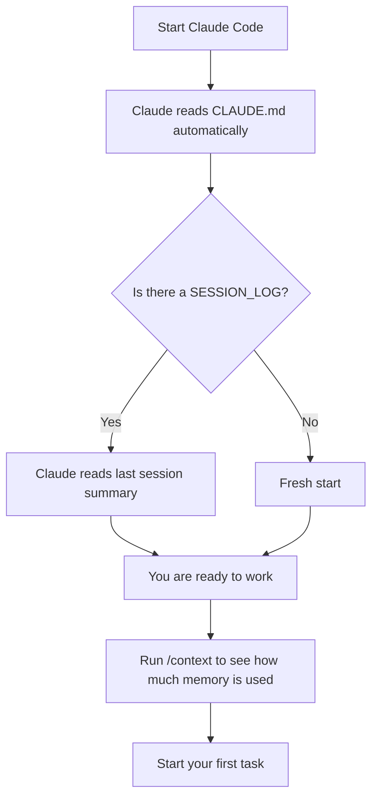
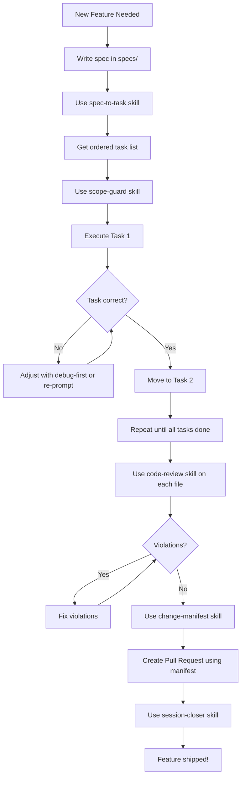
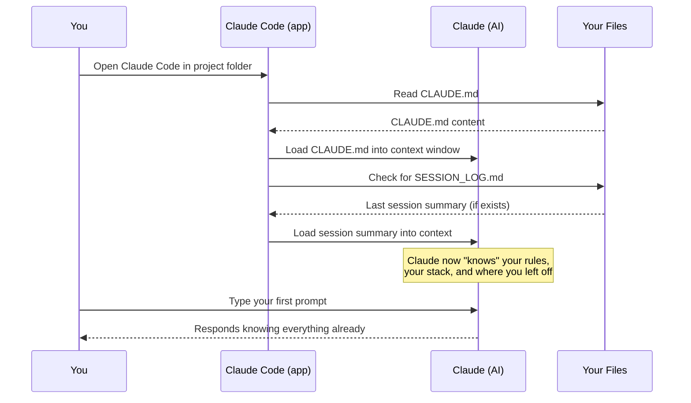
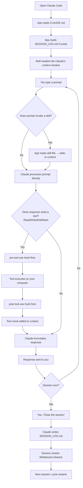

# The Claude Code Framework — The Complete Beginner's Guide

> **For anyone just starting out.**
> Written like a teacher sitting next to you, explaining everything step by step.
> By the end of this guide, you will understand everything and be ready to use this framework on any project.

---

## Before We Start — The Big Idea in One Sentence

> **This framework is a set of instructions, habits, and tools that make Claude (your AI coding helper) work smarter, faster, and safer — on every project.**

---

## Part 1 — What Is Claude Code?

### Think of it Like This

Imagine you have a **very smart helper** who can write code, fix bugs, and build entire features for you. This helper is called **Claude**.

But here is the problem — every time you start a new day, Claude **forgets everything** from yesterday. It does not know your project. It does not know your rules. It does not know how you like things done.

So every day you would have to say:
> "Hey Claude, remember — we are building a recruitment website, we use TypeScript, we never delete files without asking, we always write tests first, and please don't add extra stuff I didn't ask for..."

That takes forever. And you might forget to say something important.

### The Solution — The Framework

The **Claude Code Framework** is like a **recipe book + rulebook + toolbox** that you set up ONCE and then Claude reads it automatically at the start of every session.

You never have to re-explain your rules again.

```
Without Framework:                    With Framework:
─────────────────                     ──────────────────────────────
You: "Hey Claude, we use              Claude opens CLAUDE.md and
TypeScript, we never..."              already knows everything.
Claude: "Got it."
(tomorrow it forgets)                 You just say: "Build the
You: "Hey Claude, we use              login page."
TypeScript, we never..."              Done.
```

---

## Part 2 — The Map (Big Picture)

Here is everything the framework contains and how it connects:

```mermaid
graph TD
    A[Your Project] --> B[CLAUDE.md\nThe Rulebook]
    A --> C[skills/\nSpecial Moves]
    A --> D[.claude/settings.json\nPermissions + Safety]
    A --> E[hooks/\nAutomatic Actions]
    A --> F[prompts/\nCopy-Paste Templates]
    A --> G[specs/\nFeature Blueprints]
    A --> H[workflow/\nDaily Habits]

    B --> B1[Identity: who Claude is]
    B --> B2[Output Rules: how Claude writes]
    B --> B3[Scope Rules: what Claude touches]
    B --> B4[Your stack: language, framework]

    C --> C1[debug-first\nFind bugs before fixing]
    C --> C2[scope-guard\nDon't touch extra files]
    C --> C3[code-review\nCheck quality]
    C --> C4[spec-to-task\nPlan features]
    C --> C5[change-manifest\nWhat changed?]
    C --> C6[minimal-output\nCode only, no chatter]

    D --> D1[deny: block dangerous commands]
    D --> D2[ask: ask before risky actions]
    D --> D3[allow: safe commands pass through]

    E --> E1[pre-tool-use: check before action]
    E --> E2[post-tool-use: log after action]
    E --> E3[pre-compact: save before compressing]
```



---

## Part 3 — Meet HireFlow (Our Example Project)

**For this whole guide, we will build a real project called HireFlow.**

HireFlow is a recruitment website. Here is what it does:

```
HireFlow — What It Does
────────────────────────────────────────────────
  Job Seekers can:
    ✅ Browse open job positions
    ✅ Submit job applications
    ✅ Track their application status

  HR Managers can:
    ✅ Post new job openings
    ✅ Review incoming applications
    ✅ Schedule interviews
    ✅ Accept or reject candidates

  Tech Stack:
    - TypeScript + Node.js (backend)
    - React (frontend)
    - PostgreSQL (database)
    - Jest (testing)
────────────────────────────────────────────────
```

We will use HireFlow as our example for EVERYTHING in this guide.

---

## Part 4 — The Files and Folders (What Each Piece Does)

Think of the framework folder like a **school backpack**. Here is what is inside:

```
claude-framework/
│
├── CLAUDE.md              ← The Rulebook (Claude reads this every session)
├── CLAUDE-TEMPLATE.md     ← Blank Rulebook template (copy to new projects)
├── PROFILE.md             ← Who you are (Claude reads this every session)
├── .claudeignore          ← "Don't look in here" list (token budget protector)
│
├── .claude/
│   ├── settings.json      ← Safety rules + spending limit
│   └── skills/            ← Skills only for this framework repo
│
├── skills/                ← Skills you copy to every project
│   ├── debug-first.md
│   ├── scope-guard.md
│   ├── code-review.md
│   └── ... (17 total)
│
├── hooks/                 ← Automatic robot actions
│   ├── pre-tool-use.ps1
│   ├── post-tool-use.ps1
│   └── pre-compact.ps1
│
├── prompts/               ← Copy-paste prompt templates
│   ├── golden-prompts.md           ← 12 ready-to-use prompt patterns
│   ├── mega-prompt-template.md     ← Full XML template for complex tasks
│   ├── managing-output-length.md   ← Reference card for output control
│   └── prompt-decisions.md        ← Which prompt pattern for which situation
│
├── specs/                 ← Feature blueprints
│   └── _template.md
│
└── workflow/              ← Daily habits and checklists
    ├── daily-checklist.md
    ├── token-discipline.md         ← 10-rule token cost checklist
    └── project-setup.md
```

---

## Part 5 — CLAUDE.md (The Rulebook)

### What Is It?

CLAUDE.md is the **most important file in the whole framework.**

Every time you open Claude Code, it reads this file first. It is like a **note taped to Claude's desk** that says exactly how to behave.

### Why Does It Matter?

Without CLAUDE.md, Claude makes its own decisions about:
- How long to make responses
- Whether to add extra files you didn't ask for
- Which coding style to use
- What language/framework to use

With CLAUDE.md, Claude knows all of this without being told.

### What Goes in CLAUDE.md?

Think of it in 5 sections:

```
┌─────────────────────────────────────────────┐
│  SECTION 1: Identity                        │
│  "You are a precise senior engineer."       │
│  "Do only what is asked. Nothing more."     │
├─────────────────────────────────────────────┤
│  SECTION 2: Output Rules                    │
│  "No 'Sure! Here is...' at the start."      │
│  "No summary at the end."                   │
│  "Return only what was asked for."          │
├─────────────────────────────────────────────┤
│  SECTION 3: Scope Rules                     │
│  "Only touch files I name."                 │
│  "Don't refactor nearby code."              │
│  "If you need to touch another file, STOP." │
├─────────────────────────────────────────────┤
│  SECTION 4: Your Stack                      │
│  "Language: TypeScript, Node 20"            │
│  "Framework: Express + React"               │
│  "Tests: Jest"                              │
├─────────────────────────────────────────────┤
│  SECTION 5: Hard Rules                      │
│  "Never touch .env files"                   │
│  "Never install packages without asking"    │
│  "Never commit without permission"          │
└─────────────────────────────────────────────┘
```

### HireFlow Example — What HireFlow's CLAUDE.md Looks Like

```markdown
# CLAUDE.md — HireFlow Project

## Identity
You are a precise senior software engineer.
Do only what is asked. Nothing more.

## Output Rules
- No preamble (no "Sure!", "Of course!", "Here is...")
- No closing summary
- Return only the modified function or file, not the whole project
- Comments only where logic is non-obvious

## Scope Rules
- Only touch the file(s) explicitly named in the prompt
- If a fix needs an unmentioned file, STOP and report it first
- No drive-by refactors
- No new dependencies without approval

## Tech Stack
- Language: TypeScript, Node 20
- Frontend: React 18, Tailwind CSS
- Backend: Express.js
- Database: PostgreSQL (using Prisma ORM)
- Tests: Jest + React Testing Library
- Linter: ESLint + Prettier

## Project Structure
- /src/api        — Express routes and controllers
- /src/components — React components
- /src/services   — Business logic
- /src/types      — TypeScript interfaces
- /tests          — All test files

## Hard Rules
- Never touch .env files
- Never run migrations without explicit instruction
- Never commit or push without explicit instruction
- Never install npm packages without asking first

## Skills Available
- skills/debug-first.md       → Any bug or error
- skills/scope-guard.md       → Multi-file or risky changes
- skills/code-review.md       → Pre-merge checks
- skills/spec-to-task.md      → Before starting any feature
- skills/change-manifest.md   → After any multi-file edit
- skills/session-closer.md    → End of each session
```

---

## PROFILE.md — Claude's Personal Notes About You

This is the **companion file to CLAUDE.md** and the most underused part of the framework.

CLAUDE.md tells Claude how to work on your **project**.
PROFILE.md tells Claude who **you** are.

Think of the difference like this:

| CLAUDE.md says... | PROFILE.md says... |
|---|---|
| "Use TypeScript." | "My name is Prabhu. I'm a senior engineer." |
| "No console.log in production." | "When I ask a question, give me the answer first." |
| "Write tests for every function." | "I'm actively learning system architecture." |
| "Use Prisma ORM." | "I dislike long preambles and cautious disclaimers." |

With PROFILE.md filled in, Claude adapts to **you** — not just to the project.

### How to Fill In PROFILE.md

The file lives at the root of your project. Open it and replace the placeholders:

```markdown
## Who I Am
- Name: Prabhu
- Role: Senior Software Engineer
- Current Project: HireFlow — recruitment platform

## Communication Style
- When explaining: Be direct. Use examples over abstract descriptions.
- Tone I prefer: Peer-to-peer, no fluff
- What I dislike: Long preambles, repeating what I said back to me
- When I ask a question: Answer first, context second

## Decision Patterns
- I prefer simple solutions over clever ones
- I prefer editing existing files over creating new ones
- I am cost-conscious with tokens — keep responses tight

## Notes
- We always use camelCase for variables
- Our API uses snake_case keys in responses
```

### When Does Claude Read PROFILE.md?

Every session. At startup, alongside CLAUDE.md:

```
Claude Code opens
        ↓
Reads CLAUDE.md  →  loads project rules
        ↓
Reads PROFILE.md →  loads who you are
        ↓
Claude knows: the project rules AND the person giving the instructions
```

### Warning: The Setup Check

PROFILE.md ships with placeholder text like `[Your name]`. If you forget to fill it in, the `session-closer` skill will warn you before saving your session log.

> **Fill in PROFILE.md before your first real session on any new project.**

---

## Part 6 — Skills (The Special Moves)

### What Is a Skill?

A skill is like a **cheat code** for Claude.

Instead of writing a long explanation every time, you say 3 words and Claude activates a whole set of behaviors.

```
Without skill:                        With skill:
──────────────────────                ────────────────────────────
"Hey Claude, before you fix           "Use debug-first skill."
this bug, I want you to first
tell me what you think is             Claude immediately:
wrong, and where exactly,             1. States expected behavior
and how big the fix is,               2. States actual behavior
and then WAIT for me to               3. Points to likely cause
approve before changing               4. States fix scope
anything..."                          5. Waits for approval
```

### How Do You Use a Skill?

You just type the trigger phrase:

```
Use debug-first skill.
Use scope-guard skill.
Use code-review skill on src/api/jobs.ts
Use spec-to-task skill on specs/applications.md
Use change-manifest skill.
```

That is it. Three to five words.

### The Skills Library — All 17 Skills Explained

#### Group 1: Daily Work Skills

---

**Skill 1: `debug-first`**
```
Invoke:  "Use debug-first skill."
When:    Something is broken. A bug. An error. Unexpected behavior.

What it does:
  Before touching ANY code, Claude must:
  1. Say what should be happening (expected)
  2. Say what IS happening (actual)
  3. Point to the exact file and line number causing it
  4. Say how small or big the fix needs to be
  5. STOP and wait for your approval before fixing anything

Why this matters:
  Without this, Claude guesses and sometimes fixes the WRONG thing.
  This skill forces diagnosis before surgery — just like a doctor.

HireFlow Example:
  Bug: "Applications are not saving to the database."

  Without skill → Claude immediately starts changing code everywhere.

  With skill:
  EXPECTS: POST /api/applications saves a new row in the applications table
  ACTUAL:  POST /api/applications returns 200 but no row is created
  CAUSE:   src/api/applications.ts:47 — await is missing before db.create()
  FIX SCOPE: One line change in applications.ts only
  STATUS: Waiting for approval to implement.
```

---

**Skill 2: `scope-guard`**
```
Invoke:  "Use scope-guard skill."
When:    You are about to ask Claude to change multiple files,
         or any task where Claude might "help extra" beyond what you asked.

What it does:
  Locks Claude to ONLY what you named.
  If Claude discovers it needs to change an unmentioned file,
  it STOPS and shows a blocker instead of changing it silently.

  SCOPE BLOCKER
  Required change: src/services/email.ts:23
  Reason: sendConfirmation() is missing a parameter
  Need approval to proceed.

Why this matters:
  Claude is enthusiastic. Without a fence, it "cleans up while it's in there."
  This causes unexpected changes that break other things.

HireFlow Example:
  Task: "Add validation to the job application form."
  Without scope-guard → Claude also "improves" the login form,
                        updates some types, and refactors a service.
  With scope-guard → Claude only touches the application form.
                     Anything else triggers a SCOPE BLOCKER.
```

---

**Skill 3: `code-review`**
```
Invoke:  "Use code-review skill on src/api/jobs.ts"
When:    Before merging code. After writing a feature. Quality check.

What it does:
  Reviews the named file against your rules from CLAUDE.md.
  Returns ONLY violations. Nothing else.
  No suggestions. No praise. No rewrites.

  VIOLATIONS: 2 found

  [1] src/api/jobs.ts:34
      Rule:    No raw SQL
      Issue:   Direct SQL string used instead of Prisma ORM

  [2] src/api/jobs.ts:89
      Rule:    No console.log in production code
      Issue:   console.log('job created') on line 89

Why this matters:
  Gets a second opinion before code ships.
  Catches the rules you forgot while writing fast.

HireFlow Example:
  After building the "Post a Job" feature:
  "Use code-review skill on src/api/jobs.ts"
  → Catches 2 violations before they reach production.
```

---

**Skill 4: `spec-to-task`**
```
Invoke:  "Use spec-to-task skill on specs/applications.md"
When:    You have written a spec for a feature and are ready to build it.

What it does:
  Reads your spec and converts it into a numbered task list.
  Each task = one file, one change, clearly stated.
  Tasks are ordered so each depends on the previous ones being done.

  FEATURE: Job Application Form
  SPEC:     specs/applications.md
  TASKS:

  [ ] Task 1
      File:       src/types/application.ts
      Change:     Create Application TypeScript interface
      Preserve:   Nothing (new file)
      Depends on: none

  [ ] Task 2
      File:       src/api/applications.ts
      Change:     Add POST /api/applications route
      Preserve:   Existing routes
      Depends on: Task 1

Why this matters:
  Big features feel overwhelming.
  This breaks them into safe, one-at-a-time steps you can approve individually.

HireFlow Example:
  You have specs/job-posting.md written.
  "Use spec-to-task skill on specs/job-posting.md"
  → Claude gives you 7 ordered tasks. You work through them one by one.
```

---

**Skill 5: `change-manifest`**
```
Invoke:  "Use change-manifest skill."
When:    After Claude has changed multiple files. Before committing.

What it does:
  Produces an exact log of what changed, why, and what was NOT touched.

  CHANGE MANIFEST
  ═══════════════════════════════════

  Modified:
    src/api/applications.ts
      + Added POST /api/applications route
      ~ Updated error handling to use AppError class
      ✓ preserved: existing GET route unchanged

  Created:
    src/types/application.ts
      Purpose: TypeScript interface for Application model

  Spec Reference:
    specs/applications.md § 4.1 Submit Application

  ═══════════════════════════════════

Why this matters:
  Perfect for pull request descriptions.
  Proves exactly what changed — no surprises in code review.
```

---

**Skill 6: `minimal-output`**
```
Invoke:  "Use minimal-output skill."
When:    Any time. Especially when you just want CODE, no explanation.

What it does:
  Strips all narration from Claude's responses.
  No "Here is the function you asked for..."
  No "This implementation uses the following approach..."
  Just code. Clean. Fast.

HireFlow Example:
  Without skill: Claude writes 200 lines of explanation + 20 lines of code.
  With skill:    Claude writes 20 lines of code.
```

---

#### Group 2: Output + Session Skills

---

**Skill 7: `session-closer`**
```
Invoke:  "Close the session." or "Use session-closer skill."
When:    End of every work session — before closing Claude Code.

What it does:
  Saves a summary of what happened to SESSION_LOG.md:
  - What was built
  - What decisions were made
  - What is still unfinished
  - Anything Claude noticed that needs attention

Why this matters:
  Next session, Claude reads this log and picks up EXACTLY where you left off.
  No re-explaining. No "where were we?"

HireFlow Example:
  End of day → "Close the session."
  Tomorrow morning → Claude reads the log and knows:
    "We finished the job listing page. The application form
     is 50% done — the validation is missing. Decision was
     made to NOT use email verification for MVP."
```

---

**Skill 8: `output-control`**
```
Invoke:  "Use output-control skill."
When:    You need Claude to respond in a very specific length or format.

What it does:
  Activates XML tag format for controlling output exactly:

  <format>numbered-list</format>
  <length>5 items max</length>
  <sections>Problem, Solution, Steps</sections>
```

---

**Skill 9: `structured-response`**
```
Invoke:  "Use structured-response skill."
When:    You need a response divided into clearly labeled sections.

HireFlow Example:
  "Use structured-response skill. Compare REST vs GraphQL for HireFlow's API."
  → Claude responds with labeled sections:
    ## Overview
    ## Pros of REST for HireFlow
    ## Cons of REST for HireFlow
    ## Recommendation
```

---

#### Group 3: Project Health Skills

---

**Skill 10: `healthcheck`**
```
Invoke:  "Use healthcheck skill."
When:    After setting up the framework on a new project.
         When something feels wrong with your setup.

What it does:
  Verifies that all framework pieces are in place and connected correctly.
  Reports missing files, broken hooks, unconfigured settings.
```

---

**Skill 11: `decision-log`**
```
Invoke:  "Use decision-log skill."
When:    You just made an architectural decision you need to remember.

HireFlow Example:
  "We decided to use Prisma instead of raw SQL. Use decision-log skill."
  → Claude logs: Date, Decision, Reason, Alternatives Considered, Who Decided.
```

---

**Skill 12: `safe-cleanup-with-backup`**
```
Invoke:  "Use safe-cleanup-with-backup skill."
When:    About to delete files or folders.

What it does:
  Creates a backup FIRST, then performs the deletion.
  If something goes wrong, you can restore from the backup.
  Never skip this before a big cleanup.
```

---

**Skill 13: `project-scan`**
```
Invoke:  "Use project-scan skill on /path/to/project"
When:    Starting to use this framework on an EXISTING project.

What it does:
  Scans the entire project and produces a gap report:
  - What tech stack is being used
  - What framework files are missing
  - What rules should be in CLAUDE.md
  - What skills would help this project
```

---

**Skill 14: `framework-apply`**
```
Invoke:  "Use framework-apply skill."
When:    After project-scan. Ready to install the framework.

What it does:
  Installs the framework files into your project:
  - Creates CLAUDE.md with your tech stack filled in
  - Copies relevant skills
  - Sets up .claude/settings.json
  - Creates the specs/ and workflow/ folders
```

---

#### Group 4: Advanced Output Skills

---

**Skill 15: `followup-refine`**
```
Invoke:  "Use followup-refine skill."
When:    You have a technical explanation that needs to reach two different audiences
         (e.g. engineers AND a non-technical manager or stakeholder).

What it does:
  Takes any technical output and produces TWO versions:
  1. Full technical depth  (for engineers)
  2. Plain English summary (for everyone else)

HireFlow Example:
  You just designed the application submission API.
  Product manager asks: "Can you explain how applications are submitted?"

  "Use followup-refine skill. Explain the application submission flow in HireFlow."

  Engineers get: POST /api/applications → validation → Prisma create → 201 response.
  PM gets: "Candidates fill in their details on the form, click Submit,
            and the data saves automatically. They see a success message. That's it."
```

---

**Skill 16: `duplicate-structure-audit`**
```
Invoke:  "Use duplicate-structure-audit skill."
When:    You suspect there are duplicate folders or files in your project.
         After a messy migration or scaffolding session.

What it does:
  Scans your project for folders and files with the same name at different paths.
  Classifies each as:
    SAFE     — one is clearly an older copy, can be deleted
    CONFLICT — both appear active, needs your decision
    UNKNOWN  — cannot determine without more context

  Recommendations are given, but NOTHING is deleted automatically.
  Always pair with safe-cleanup-with-backup before acting.

HireFlow Example:
  After a rushed setup you see both src/components and src/component.
  "Use duplicate-structure-audit skill."
  → Claude finds 3 conflicts, tells you which folder is canonical, proposes cleanup.
  → You run safe-cleanup-with-backup first, then accept the cleanup.
```

---

**Skill 17: `jsx-to-standalone-html`**
```
Invoke:  "Use jsx-to-standalone-html skill on src/components/JobCard.tsx"
When:    You want to share a React component as a browser demo
         that works WITHOUT Node.js, npm, or any dev setup.

What it does:
  Converts a JSX/TSX component into a single .html file.
  All styles, logic, and markup bundled in one file.
  Double-click in Windows Explorer → opens in Chrome → it just works.

HireFlow Example:
  Stakeholder wants to see the job card design but has no dev environment.
  "Use jsx-to-standalone-html skill on src/components/JobCard.tsx"
  → Claude produces JobCard.html. Attach to email. Stakeholder opens it. Done.

Note: Only useful on React / JSX / TSX projects.
```

---

## Part 7 — The 4 Elements (The Magic Formula)

### Every single prompt you write should have these 4 things:

```
┌───────────────────────────────────────────────────────────┐
│                                                           │
│   SCOPE   → Exactly which file or function               │
│   ACTION  → Exactly ONE thing to do                      │
│   FENCE   → What must NOT be touched                     │
│   OUTPUT  → What to return and what to leave out         │
│                                                           │
└───────────────────────────────────────────────────────────┘
```

### The Goal Over Time

```
Week 1:  You write all 4 elements in every prompt
Week 2:  FENCE and OUTPUT live in CLAUDE.md (auto-loaded)
Week 3:  Your prompts are just SCOPE + ACTION
Week 4:  "Add validation to the job form." ← complete prompt
```

### HireFlow Examples

```
BAD PROMPT (vague):
"Make the job application better."

Claude does not know:
- Which file?
- What kind of "better"?
- What to leave alone?
- What to return?

Result: Claude rewrites half the project.

────────────────────────────────────────────────────────────

GOOD PROMPT (4 elements):
"In src/components/ApplicationForm.tsx,            ← SCOPE
add email format validation to the email field.    ← ACTION
Do not touch the name or resume fields.            ← FENCE
Return only the modified component. No explanation."← OUTPUT

Result: Claude changes exactly one thing. Nothing else.

────────────────────────────────────────────────────────────

GREAT PROMPT (after CLAUDE.md and skills are loaded):
"Use scope-guard skill.
In src/components/ApplicationForm.tsx,
add email format validation to the email field."

(FENCE and OUTPUT are already in CLAUDE.md and scope-guard)
```

---

## Part 8 — Golden Prompts (The Copy-Paste Collection)

These are 12 ready-to-use prompt templates. Copy them, fill in the brackets, and send.

### Prompt 1: Fix Something in a File

```
In [FILE], [ONE CHANGE].
Do not touch [WHAT TO LEAVE ALONE].
Return only the modified [function/section/file].
No explanation.
```

**HireFlow Example:**
```
In src/api/jobs.ts, fix the missing await on the database create call on line 47.
Do not touch the GET route or the error handling.
Return only the modified createJob function.
No explanation.
```

---

### Prompt 2: Plan Before Building (Always Use This for Big Tasks)

```
Before writing any code, give me your step-by-step plan for:
[TASK DESCRIPTION]

Do not execute. Wait for my confirmation.
```

**HireFlow Example:**
```
Before writing any code, give me your step-by-step plan for:
Building the interview scheduling feature — HR can pick a date/time
and the candidate gets an email confirmation.

Do not execute. Wait for my confirmation.
```

---

### Prompt 3: Build From a Spec

```
Build [FEATURE] according to specs/[SPEC FILE].
Constraints:
- [CONSTRAINT 1]
- [CONSTRAINT 2]
Output: [EXACTLY WHICH FILES]
Stop after that.
```

**HireFlow Example:**
```
Build the job application form according to specs/application-form.md.
Constraints:
- No new npm packages
- Do not modify the existing form wrapper component
Output: src/components/ApplicationForm.tsx only.
Stop after that.
```

---

### Prompt 4: Find the Bug (Use debug-first Skill First!)

```
Use debug-first skill.
[DESCRIBE THE BUG HERE]
```

**HireFlow Example:**
```
Use debug-first skill.
When a candidate submits an application, the confirmation email is not being sent.
The API returns 200 but the email never arrives.
```

---

### Prompt 5: Code Review Before Merging

```
Use code-review skill on [FILE OR DIRECTORY].
```

**HireFlow Example:**
```
Use code-review skill on src/api/applications.ts
```

---

### Prompt 6: Refactor Safely

```
Refactor [FILE/FUNCTION] for [ONE GOAL: readability/performance/simplicity].
Do not change behavior.
Do not change external interfaces or function signatures.
Show before/after for the key change only.
```

**HireFlow Example:**
```
Refactor src/services/emailService.ts for readability.
Do not change behavior.
Do not change exported function signatures.
Show before/after for the key change only.
```

---

### Prompt 7: Exact Output Format

```
[TASK].
Return:
- [WHAT THE OUTPUT LOOKS LIKE]
- [WHAT IT MUST NOT INCLUDE]
- Stop after [STOP CONDITION].
```

**HireFlow Example:**
```
Write unit tests for the validateApplication function in src/services/validator.ts.
Return:
- Jest test blocks only
- No imports (I will add them)
- Stop after the last test case. No summary.
```

---

### Prompt 12: Complex Multi-Requirement Task (XML Format)

```xml
<task>
  <goal>[Single sentence — what done looks like]</goal>
  <requirements>
    - [Requirement 1]
    - [Requirement 2]
    - [Requirement 3]
  </requirements>
  <constraints>
    - [What must not change]
    - [What must be preserved]
  </constraints>
  <output>[Exactly which files to return]</output>
</task>
```

**HireFlow Example:**
```xml
<task>
  <goal>Add a rate limiter to the job application endpoint</goal>
  <requirements>
    - Max 3 applications per email per 24 hours
    - Return 429 with a clear error message if limit is hit
    - Store limit counters in the existing Redis client
  </requirements>
  <constraints>
    - Do not modify the authentication middleware
    - Do not change existing application validation logic
  </constraints>
  <output>src/api/applications.ts only. No explanation.</output>
</task>
```

---

## Part 9 — settings.json (Safety + Permissions)

### Think of it Like Traffic Lights

```
🔴 DENY  → Blocked always, no matter what
🟡 ASK   → Claude asks you first before doing this
🟢 ALLOW → Passes through automatically, no questions asked
```

### HireFlow's settings.json

```json
{
  "maxBudgetUsd": 50,

  "permissions": {
    "deny": [
      "Read(.env*)",
      "Write(.env*)",
      "Bash(rm -rf*)",
      "Bash(sudo *)",
      "Bash(git push --force*)"
    ],
    "ask": [
      "Bash(npm install*)",
      "Bash(git push*)"
    ],
    "allowedTools": [
      "Read",
      "Write",
      "Edit",
      "Bash(git status)",
      "Bash(git diff*)",
      "Bash(git add*)",
      "Bash(git commit*)",
      "Bash(npm run *)",
      "Bash(npm test*)"
    ]
  }
}
```

### Why These Rules?

| Rule | Why |
|---|---|
| `deny Read(.env*)` | .env has passwords. Nobody should read it, ever. |
| `deny Bash(rm -rf*)` | This deletes everything. Block it completely. |
| `deny git push --force*` | Force push can destroy your main branch permanently. |
| `ask npm install*` | Installing new packages costs money and adds risk. Ask first. |
| `ask git push*` | Always ask before pushing code to the shared repo. |
| `allow npm run *` | Running scripts (build, test, dev) is safe. |
| `maxBudgetUsd: 50` | Claude can't spend more than $50 in API calls per session. |

---

## .claudeignore — What Claude Cannot See

`.claudeignore` works exactly like `.gitignore` — but for Claude.

Files and folders listed here are **invisible to Claude**. It cannot read them, reference them, or spend tokens on them.

```
Without .claudeignore:
  Project has 10,000 files
  Claude can potentially read any of them
  One wrong "let me check the context" → 50,000 tokens gone

With .claudeignore listing node_modules/, dist/, logs/:
  Claude sees only the ~50 files that actually matter
  Token cost: minimal
```

### Where to Put It

Create it in your project root, right next to CLAUDE.md:

```
hireflow/
├── CLAUDE.md
├── PROFILE.md
├── .claudeignore     ← create here
├── .gitignore
├── src/
└── package.json
```

### What to Put In It

```
# Build output — Claude doesn't need compiled files
dist/
build/
.next/
out/

# Dependencies — NEVER let Claude read these
node_modules/

# Logs — not useful for coding
*.log
logs/

# Environment files — extra protection (deny rules also cover this)
.env
.env.*

# Lock files — auto-generated, irrelevant to Claude
package-lock.json
yarn.lock
pnpm-lock.yaml

# Large data / media — would eat tokens with zero benefit
*.csv
*.png
*.jpg
*.mp4
seed-data/
```

> **Rule:** If Claude doesn't actively need a file to do its job, put it in `.claudeignore`. Start aggressive. Add back only what you need.

---

## Part 10 — Hooks (Automatic Robot Actions)

### What Is a Hook?

A hook is an **automatic action** that happens before or after Claude does something.

```
You ask Claude to write a file
         ↓
[pre-tool-use hook fires] ← checks if it's safe
         ↓
Claude writes the file
         ↓
[post-tool-use hook fires] ← logs what happened
```

### The 3 Hooks

| Hook | When It Fires | What It Does in HireFlow |
|---|---|---|
| `pre-tool-use.ps1` | BEFORE Claude edits/runs anything | Logs the action, checks scope |
| `post-tool-use.ps1` | AFTER Claude edits/runs anything | Records what changed, updates change log |
| `pre-compact.ps1` | BEFORE context is compressed | Saves current state so nothing is lost |

### Practical Hooks You Can Add

**Auto-format code after every file write:**
```json
{
  "matcher": "Write",
  "hooks": [{ "type": "command", "command": "prettier --write {filePath}" }]
}
```

**Run tests automatically after changing TypeScript files:**
```json
{
  "matcher": "Write",
  "hooks": [{ "type": "command", "command": "npm test -- {filePath}",
              "match": { "path": "src/**/*.ts" } }]
}
```

---

## Part 11 — Specs (Feature Blueprints)

### What Is a Spec?

Before you build a feature, you write a **spec** — a blueprint that describes exactly what it should do.

This is like an architect drawing a house plan before builders start laying bricks.

### Why Write a Spec First?

```
Without spec:
  You: "Build me an application form."
  Claude: Builds something.
  You: "That's not what I meant..."
  Claude: Rebuilds it.
  You: "Still not right..."
  → Wasted time, wasted money.

With spec:
  You write exactly what you want.
  Claude reads it.
  Claude builds exactly that.
  Done.
```

### HireFlow Spec Example — Job Application Form

```markdown
# Spec: Job Application Form

Status: Approved
Spec ID: SPEC-003

## 1. Problem
Candidates need a way to apply for jobs on the platform.
Currently there is no form or submission mechanism.

## 2. Goal
A candidate can fill in and submit a job application in under 2 minutes.

## 3. Scope

### In Scope
- Application form with: full name, email, resume upload, cover letter
- Submit button that calls POST /api/applications
- Success message after submission
- Email validation on the email field

### Out of Scope
- Application editing after submission
- Multi-step forms
- LinkedIn import

## 4. Behavior

### 4.1 Submit Application
Input:  name (string), email (string), resumeUrl (string), coverLetter (string)
Output: { success: true, applicationId: "uuid" }
Edge:   If email already applied to this job → return 409 Conflict

## 5. Files Affected

| File | Change Type | Notes |
|---|---|---|
| src/components/ApplicationForm.tsx | Create | New form component |
| src/api/applications.ts | Modify | Add POST route |
| src/types/application.ts | Create | TypeScript interface |
| tests/ApplicationForm.test.tsx | Create | Unit tests |

## 6. Acceptance Criteria

- [ ] Form renders with all 4 fields
- [ ] Email field validates format
- [ ] Submission calls POST /api/applications
- [ ] Success message appears after submit
- [ ] Duplicate application returns a friendly error
```

---

## Part 12 — The Daily Workflow (What to Do Every Day)

### Morning Startup Routine



### Before Every Single Task

```
PHASE 1 CHECKLIST (takes 30 seconds):

[ ] Is there a spec for this? → REFERENCE it. Don't re-explain it.
[ ] Do I know which file(s) are in scope? → Name them in the prompt.
[ ] What must NOT change? → Say it FIRST in the prompt.
[ ] Is this complex or multi-file? → Use Plan Gate prompt. Do not skip.
[ ] Does a skill cover this? → Use it instead of explaining.
[ ] Am I about to write "and also"? → STOP. Split into two prompts.
```

### Writing the Prompt

```
PHASE 2 CHECKLIST (takes 30 seconds):

[ ] SCOPE   — exact file name is in there
[ ] ACTION  — only one thing I'm asking for
[ ] FENCE   — I said what not to touch
[ ] OUTPUT  — I said what format to return

Self-check:
[ ] Remove every word that is not SCOPE, ACTION, FENCE, or OUTPUT.
[ ] Does it still say exactly what I want? → Send it.
```

### During the Session — Context Management

```
[ ] Check /context regularly — if above 60%, compact NOW.
[ ] To compact: /compact Preserve: active specs, file paths, pending decisions.
                           Discard: completed steps, tool output details.
[ ] Switching to a completely different task? Use /clear instead.
```

### End of Session

```
[ ] Run: "Use change-manifest skill." (if you changed multiple files)
[ ] Run: "Close the session."         (always — saves your progress)
```

---

## Part 13 — Building HireFlow from Zero (Complete Walkthrough)

### Step 1: Set Up the Framework on HireFlow

```
Day 1, Minute 1 — you're starting fresh.
```

**In Claude Code, type:**
```
Use project-scan skill on C:/projects/hireflow
```

Claude scans HireFlow and produces a gap report. Then:

```
Use framework-apply skill.
```

Claude installs all framework files into HireFlow.

**Now fill in your stack in `CLAUDE.md`:**
- Language: TypeScript, Node 20
- Framework: Express + React
- Database: PostgreSQL with Prisma
- Tests: Jest

**Run the sanity check:**
```
Read CLAUDE.md. Confirm by listing:
- The 3 most important output rules
- The 2 things you must never do
- Which skills are available
No other output.
```

If Claude answers correctly → you're done. Framework is installed.

---

### Step 2: Write the Spec for Your First Feature

**Feature: Job Listings Page**

Create `specs/job-listings.md` using the spec template:
- Problem: no way to browse open jobs
- Goal: candidates can see all open positions
- Scope: listing only, no filtering yet
- Files: src/components/JobList.tsx, src/api/jobs.ts

---

### Step 3: Convert Spec to Tasks

```
Use spec-to-task skill on specs/job-listings.md
```

Claude returns:
```
FEATURE: Job Listings Page
TASKS:

[ ] Task 1
    File:       src/types/job.ts
    Change:     Create Job TypeScript interface
    Depends on: none

[ ] Task 2
    File:       src/api/jobs.ts
    Change:     Add GET /api/jobs route returning all open jobs
    Depends on: Task 1

[ ] Task 3
    File:       src/components/JobList.tsx
    Change:     Create JobList component that fetches and displays jobs
    Depends on: Task 2

[ ] Task 4
    File:       tests/JobList.test.tsx
    Change:     Add unit tests for JobList component
    Depends on: Task 3
```

---

### Step 4: Execute Tasks One at a Time

**Task 1 — Create job types:**
```
Use scope-guard skill.
Build Task 1 from specs/job-listings.md:
Create the Job TypeScript interface in src/types/job.ts.
Include: id, title, company, location, salary, postedAt, status.
Return only the new file.
```

**Review Claude's output. If good → confirm. If not → ask it to adjust.**

**Task 2 — Create the API route:**
```
Use scope-guard skill.
Build Task 2 from specs/job-listings.md:
In src/api/jobs.ts, add GET /api/jobs that returns all open jobs from the database.
Use Prisma. Do not touch existing routes.
Return only the modified file.
```

**Task 3 — Build the component:**
```
Use scope-guard skill.
Build Task 3 from specs/job-listings.md:
Create src/components/JobList.tsx.
It fetches from GET /api/jobs on mount and renders a list of job cards.
Use Tailwind for styling consistent with our existing components.
Return only the new file.
```

**Task 4 — Write the tests:**
```
Build Task 4 from specs/job-listings.md:
Write Jest tests for src/components/JobList.tsx.
Test: renders correctly, shows loading state, shows jobs after fetch, handles empty state.
Return test blocks only. No imports.
```

---

### Step 5: Review Before Merging

```
Use code-review skill on src/api/jobs.ts
Use code-review skill on src/components/JobList.tsx
```

Fix any violations, then:

```
Use change-manifest skill.
```

Review the manifest. It becomes your pull request description.

---

### Step 6: End the Day

```
Close the session.
```

Claude saves:
- Job listings page is complete ✅
- Tests passing ✅
- Next: Application form feature (SPEC-003 is ready)
- Decision made: not using pagination in v1

Tomorrow, Claude reads this and picks up immediately.

---

### Full HireFlow Feature Flow Chart



---

## Part 14 — Under the Hood: What Claude Is Actually Doing

This is the most misunderstood part. Most people use Claude Code without ever understanding what is actually happening behind the scenes. Once you see it, everything makes sense.

---

### The Context Window — Claude's Working Memory

Imagine Claude has a **whiteboard**. Everything it can see and work with in one session is written on that whiteboard:

```
┌─────────────────────────────────────────────────────────────┐
│                    CLAUDE'S WHITEBOARD                      │
│                    (Context Window)                         │
├─────────────────────────────────────────────────────────────┤
│  ✅ CLAUDE.md content         (loaded at start)            │
│  ✅ SESSION_LOG.md content    (loaded at start)            │
│  ✅ Your messages             (every prompt you send)      │
│  ✅ Claude's responses        (every reply it gave)        │
│  ✅ Files Claude read         (content of every file read) │
│  ✅ Command output            (results of every tool used) │
│                                                             │
│  ⚠️  Whiteboard is limited in size.                        │
│      When it fills up → quality drops → things get lost.   │
└─────────────────────────────────────────────────────────────┘
```

**Critical:** Claude does NOT have permanent memory. When you close Claude Code, the whiteboard is erased. Next session — blank whiteboard again.

This is why CLAUDE.md exists. It gets loaded back onto the whiteboard automatically every new session.

---

### What Happens When You Open Claude Code (Step by Step)



**Key insight:** Claude Code (the app) does the loading. Claude (the AI) just receives what is put in front of it. It cannot "go looking" by itself — the app puts things into its context.

---

### What Happens When You Invoke a Skill

When you type `Use debug-first skill.`, people think Claude "activates a feature". That is not what happens.

Here is the reality:

```
You type: "Use debug-first skill."
                ↓
Claude Code reads skills/debug-first.md
                ↓
The content of that file gets added to the context window
                ↓
Claude now has those instructions visible on its whiteboard
                ↓
Claude follows them — because it can see them
```

**A skill is just instructions in a file. No magic. No code running.**

This also means:
- Skills with `agent: true` → Claude Code spawns a separate Claude instance (subagent). This protects your main context window from being filled by the skill's work.
- Skills with `agent: false` → Instructions land directly in your current context window and modify Claude's behavior in-place.

```
agent: false (in your context):          agent: true (separate context):
──────────────────────────               ─────────────────────────────────
Your conversation                         Your conversation (unchanged)
+ skill instructions added                      ↓
= Claude behaves differently              Claude Code spawns sub-Claude
                                          Sub-Claude gets: skill + task
                                          Sub-Claude does the work
                                          Result returned to your session
```

**HireFlow Example:** `code-review` has `agent: true` because it reads many files. If it ran in your context, it would eat half your whiteboard space. Instead, it runs in its own mini-session, does the review, and hands you back just the violations list.

---

### Who Writes SESSION_LOG.md? (And How?)

**Claude writes it.** Not an automatic system. Not a script.

When you say `Close the session.`, here is what happens:

```
You: "Close the session."
        ↓
Claude reads the session-closer skill instructions
        ↓
Claude looks at its whiteboard (the full conversation)
        ↓
Claude summarises: what was built, what was decided,
                   what is unfinished, what to do next
        ↓
Claude calls the Write tool → writes SESSION_LOG.md to your project folder
        ↓
Session is closed. Whiteboard cleared.
```

Next session:
```
Claude Code opens → reads SESSION_LOG.md → loads it onto the whiteboard
Claude immediately knows: "We finished job listings. Application form is next."
```

**This is why "Close the session" is not optional.** Without it, tomorrow's Claude starts completely blank.

---

### What Does /compact Do? (The Most Misunderstood Command)

Your whiteboard fills up over a long session. When it gets above ~60%, Claude starts forgetting early parts.

`/compact` is like **erasing the detailed notes but keeping the key points**:

```
BEFORE /compact:
──────────────────────────────────────────────────────────
"You asked me to create job types. Here is what I did.
 First I looked at the existing types folder. Then I read
 the Prisma schema. Then I wrote the interface. You said
 it looked good. Then you asked me to add the API route.
 I looked at the existing routes and..."
[hundreds of lines of detailed conversation history]
──────────────────────────────────────────────────────────

AFTER /compact with preservation instructions:
──────────────────────────────────────────────────────────
Context summary:
- Created src/types/job.ts (Job interface)
- Created src/api/jobs.ts (GET /api/jobs route)
- Active spec: specs/job-listings.md
- Current task: Task 3 (JobList component)
- Decision: no pagination in v1
──────────────────────────────────────────────────────────
```

The whiteboard is now mostly empty again. Work continues with the important context preserved.

**Always compact with explicit instructions:**
```
/compact Preserve: active specs, file paths touched, pending decisions, unresolved blockers.
         Discard: completed steps, raw tool output, code listings that are already in files.
```

Without those instructions, Claude decides what to keep — and it might keep the wrong things.

---

### What Do Hooks Actually Execute?

Hooks are **PowerShell scripts** (`.ps1` files) that the Claude Code app runs at specific moments. Claude the AI does NOT run them. The app does.

```
YOU ask Claude to write a file
        ↓
Claude Code: "Wait — there is a pre-tool-use hook configured."
        ↓
Claude Code runs: hooks/pre-tool-use.ps1
(This is PowerShell running on your computer — not Claude)
        ↓
Hook result is reported back to Claude
        ↓
Claude writes the file (or stops if hook returned an error)
        ↓
Claude Code runs: hooks/post-tool-use.ps1
```

**Think of it as:** Claude Code is the referee. Before and after every action, the referee checks its rulebook (hooks). If the hook says stop, the action stops — regardless of what Claude wanted to do.

---

### The Full Picture — One Session from Open to Close



---

## Part 15 — Tokens and Cost: How This Framework Saves Your Money

### What Is a Token?

A token is a small piece of text. Roughly:
- 1 token ≈ 4 characters ≈ ¾ of a word
- "Hello world" = ~3 tokens
- A 500-line file = ~2,000–3,000 tokens

**You pay for every token that goes INTO Claude and every token that comes OUT.**

```
You pay for:
  ┌─────────────────┐     ┌─────────────────┐
  │  EVERYTHING you │     │  EVERYTHING     │
  │  send to Claude │  +  │  Claude sends   │
  │  (input tokens) │     │  back to you    │
  │                 │     │  (output tokens)│
  └─────────────────┘     └─────────────────┘
```

This includes: your prompt, CLAUDE.md contents, files Claude read, skill contents, hook output, tool results, conversation history — **everything on the whiteboard**.

---

### What Burns Tokens Fast (And How to Stop It)

```
TOKEN BURNER #1: Vague prompts → back-and-forth
──────────────────────────────────────────────────
You: "Make the app better."                        → 5 tokens
Claude: "What specifically do you want?"           → 300 tokens
You: "The job form is slow."                       → 8 tokens
Claude: "Here are 5 approaches..."                 → 800 tokens
You: "Option 3 please."                            → 5 tokens
Claude: [implements option 3 + explains it]        → 1500 tokens
─────────────────────────────────────
Total: ~2,600 tokens to do one thing

One good scoped prompt: ~400 tokens for the same result.

FIX: Use the 4-Element formula. Saves 80%+ of tokens on every messy task.
```

```
TOKEN BURNER #2: Claude reads unnecessary files
──────────────────────────────────────────────────
If Claude can see node_modules/ — 50,000+ tokens consumed just reading it.
If Claude reads 5 irrelevant files to "understand context" — 10,000 tokens gone.

FIX: Use .claudeignore to hide everything Claude doesn't need.
     Use scope-guard to prevent Claude from going file-exploring.
```

```
TOKEN BURNER #3: Verbose responses
──────────────────────────────────────────────────
Claude default: explains what it did, why, what it considered,
                what you could do differently, suggestions for the future...
That might be 800 tokens of narration + 50 tokens of actual code.

FIX: Use minimal-output skill. CLAUDE.md output rules.
     Result: 50 tokens of code. 94% savings.
```

```
TOKEN BURNER #4: Re-explaining context every session
──────────────────────────────────────────────────
"Hey Claude, we're building a recruitment app. We use TypeScript.
 Our database is PostgreSQL. We use Prisma. Yesterday we finished
 the job listings page..."
→ 200+ tokens. Every. Single. Session.

FIX: CLAUDE.md + SESSION_LOG.md loaded automatically.
     You pay 0 tokens re-explaining what is already written there.
```

---

### How Each Framework Piece Saves Tokens

| Framework Piece | How It Saves Tokens | Typical Saving |
|---|---|---|
| **CLAUDE.md** | Rules loaded once instead of typed every session | 200–500 tokens per session |
| **.claudeignore** | Hides node_modules, dist, logs — prevents accidental reading | 10,000–50,000 tokens per session |
| **Skills (3 words)** | `Use debug-first skill.` = 4 tokens vs 80-word explanation = 80 tokens | 90% reduction per invocation |
| **minimal-output skill** | Cuts response verbosity from 800 tokens → 50 tokens | 90% reduction per response |
| **Specs** | Clean spec → Claude builds right first time. No back-and-forth. | 3,000–8,000 tokens per feature |
| **scope-guard** | Stops Claude reading extra files for "context" | 500–5,000 tokens per task |
| **SESSION_LOG.md** | Tomorrow's Claude picks up instantly. No re-explaining. | 200–500 tokens per session |
| **/compact** | Compresses 10,000 tokens of history → 500 token summary | Extends session by 10–20× |
| **4-Element Prompts** | One precise prompt vs. 3–5 clarification rounds | 2,000–5,000 tokens per task |
| **maxBudgetUsd: 50** | Hard stop — can't accidentally run up a $500 bill | Prevents worst-case scenarios |

> **Go deeper:** Your framework includes `workflow/token-discipline.md` — a 10-rule ranked checklist covering every common token waste pattern. Read it once and keep it open whenever costs feel high. Each rule has a bad/good example and the exact token impact.

---

### A Real Cost Comparison — With and Without Framework

```
BUILDING THE HIREFLOW JOB LISTINGS PAGE — WITHOUT FRAMEWORK:
──────────────────────────────────────────────────────────────
Session start:    Re-explain stack + rules          ~500 tokens
Vague prompt:     3 rounds of clarification         ~3,000 tokens
Claude explores:  Reads 8 files to "understand"     ~6,000 tokens
Verbose response: Code + explanation + suggestions  ~2,000 tokens
Wrong output:     1 correction round                ~1,500 tokens
Re-explaining:    "No wait, use Prisma not raw SQL" ~500 tokens
─────────────────────────────────────────────────────────────
TOTAL: ~13,500 tokens

WITH FRAMEWORK:
──────────────────────────────────────────────────────────────
Session start:    CLAUDE.md auto-loaded             200 tokens
Session resume:   SESSION_LOG.md auto-loaded        300 tokens
Spec converts:    spec-to-task (clear tasks)        ~400 tokens
Scoped prompt:    scope-guard + 4 elements          ~200 tokens
minimal-output:   Code only, no narration           ~300 tokens
─────────────────────────────────────────────────────────────
TOTAL: ~1,400 tokens

SAVINGS: ~90% fewer tokens for the same feature.
```

---

### The Token Budget Mental Model

Think of your context window like a **fuel tank**, and tokens like petrol:

```
Context window = 200,000 tokens (fuel tank size — varies by Claude model)
                 ↑
Everything on the whiteboard eats fuel

/compact = stops at a petrol station, refills the tank at low cost
Close the session = park the car, save the route, start fresh tomorrow

How to drive further on the same tank:
  → Load only what you need (CLAUDE.md + SESSION_LOG = light weight)
  → Ignore what you don't need (.claudeignore)
  → Ask for code only, not explanations (minimal-output)
  → Drive straight (4-element prompts, no u-turns)
  → Refuel before empty (/compact at 60%, not 95%)
```

---

## Part 16 — Quick Reference Card

Cut this out and keep it next to your screen.

```
┌─────────────────────────────────────────────────────────────────┐
│                    SKILLS QUICK REFERENCE                       │
├──────────────────────────────────┬──────────────────────────────┤
│ INVOKE                           │ WHEN                         │
├──────────────────────────────────┼──────────────────────────────┤
│ Use debug-first skill.           │ Something is broken          │
│ Use scope-guard skill.           │ Touching 2+ files            │
│ Use code-review skill on [file]  │ Before merging               │
│ Use spec-to-task skill on [spec] │ Starting a new feature       │
│ Use change-manifest skill.       │ After multi-file changes     │
│ Use minimal-output skill.        │ Just want the code           │
│ Use session-closer skill.        │ End of every session         │
│ Use healthcheck skill.           │ Something feels broken       │
│ Use safe-cleanup-with-backup.    │ Before deleting files        │
└──────────────────────────────────┴──────────────────────────────┘

┌─────────────────────────────────────────────────────────────────┐
│                   THE 4 ELEMENTS                                │
├─────────────────────────────────────────────────────────────────┤
│  SCOPE   → Which exact file or function                         │
│  ACTION  → One thing to do                                      │
│  FENCE   → What NOT to touch                                    │
│  OUTPUT  → What format to return, what to exclude              │
└─────────────────────────────────────────────────────────────────┘

┌─────────────────────────────────────────────────────────────────┐
│                   DAILY SEQUENCE                                │
├─────────────────────────────────────────────────────────────────┤
│  START:   Claude reads CLAUDE.md + session log automatically    │
│  BEFORE:  Run 30-second Phase 1 checklist                       │
│  PROMPT:  SCOPE + ACTION + FENCE + OUTPUT                       │
│  CHECK:   /context — compact if above 60%                       │
│  END:     change-manifest → close the session                   │
└─────────────────────────────────────────────────────────────────┘

┌─────────────────────────────────────────────────────────────────┐
│                PERMISSION TRAFFIC LIGHTS                        │
├─────────────────────────────────────────────────────────────────┤
│  🔴 DENY  → .env files, rm -rf, git push --force               │
│  🟡 ASK   → npm install, git push                              │
│  🟢 ALLOW → Read, Write, Edit, git commands, npm run           │
└─────────────────────────────────────────────────────────────────┘
```

---

## Part 17 — FAQ (Questions You Will Definitely Have)

**Q: Does Claude read my files automatically?**
> Only if you tell it to, or if a skill/hook tells it to. Claude cannot "go looking" on its own. It can only see what is placed in its context window. That is why .claudeignore is protective — it prevents the app from offering those files to Claude in the first place.

**Q: Does Claude remember things between sessions?**
> No. Every session starts with a blank whiteboard. The only reason Claude "remembers" is because CLAUDE.md and SESSION_LOG.md are loaded into the new session's context window. Without those files, it knows nothing.

**Q: My tokens are running out mid-session. What do I do?**
> Run `/compact` immediately with preservation instructions. Do not wait until your context is full — at 60% is the right time. If you are starting a completely different task, use `/clear` instead to wipe the whiteboard completely.

**Q: If I type "Use debug-first skill" — is Claude running code?**
> No. Claude Code (the app) reads `skills/debug-first.md` and adds those instructions to Claude's context. Claude then follows those instructions because it can "see" them. Nothing is being compiled or executed. It is just text being put in front of the AI.

**Q: Do I copy ALL the framework files to every project?**
> Copy the `skills/` folder, `CLAUDE-TEMPLATE.md` (rename to `CLAUDE.md`), `specs/_template.md`, and the `workflow/` folder. Run `Use framework-apply skill.` and it does this for you automatically.

**Q: What happens if I forget to use a skill?**
> Nothing bad happens. You just get a less controlled result. The skills are habits that make things better — they are not required. But the more you use them, the better your results.

**Q: Can I add my own rules to CLAUDE.md?**
> Absolutely. CLAUDE.md is yours. Add any rule you want. The more specific your rules, the more consistent Claude's behavior. If you find yourself saying the same thing in prompts repeatedly → that thing belongs in CLAUDE.md.

**Q: What is the difference between `skills/` and `.claude/skills/`?**
> `skills/` is the template library — these get copied to new projects. `.claude/skills/` contains skills only available in this framework repo's own sessions. When you install the framework on HireFlow, only `skills/` gets copied.

**Q: What if Claude ignores a rule in CLAUDE.md?**
> Make the rule more explicit. Instead of "be concise" write "responses must be under 5 sentences unless I explicitly ask for more." Vague rules get interpreted. Specific rules get followed.

**Q: How do I know if the framework is working?**
> Run: `Use healthcheck skill.` It tells you exactly what is set up correctly and what is missing.

**Q: What is the .claudeignore file for?**
> It works like .gitignore. Files listed here are hidden from Claude — it cannot see or read them. Use it to hide `node_modules/`, `dist/`, large data files, and anything else Claude does not need to see. Fewer files = cheaper API calls = faster responses.

---

## Summary — You Now Know Everything

Here is everything you learned, in 40 words:

> **CLAUDE.md** tells Claude who it is.
> **Skills** give it special moves.
> **Specs** plan features before building.
> **Prompts** follow 4 elements.
> **Hooks** automate safety.
> **The context window** is Claude's whiteboard — it resets every session.
> **Tokens** are what you pay — the framework cuts waste by 90%.
> **The daily checklist** keeps quality high.

That is the whole framework.

Now go build HireFlow. Or anything else.

---

*Claude Code Master Framework — Beginner's Guide*
*Framework version: March 2026*
