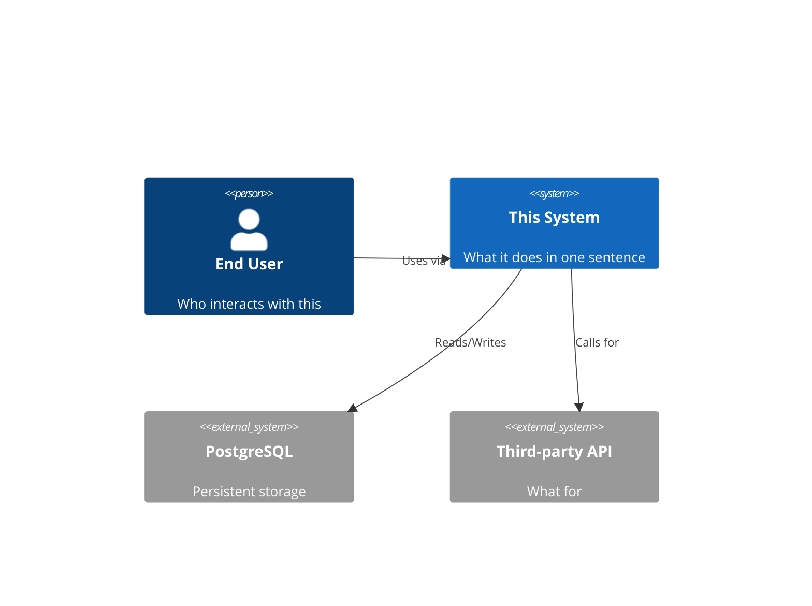
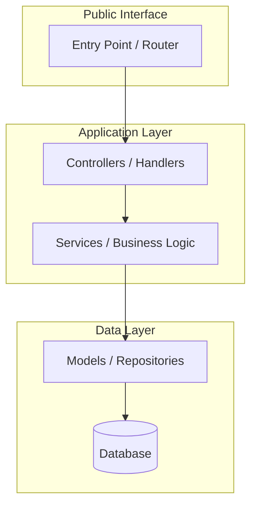
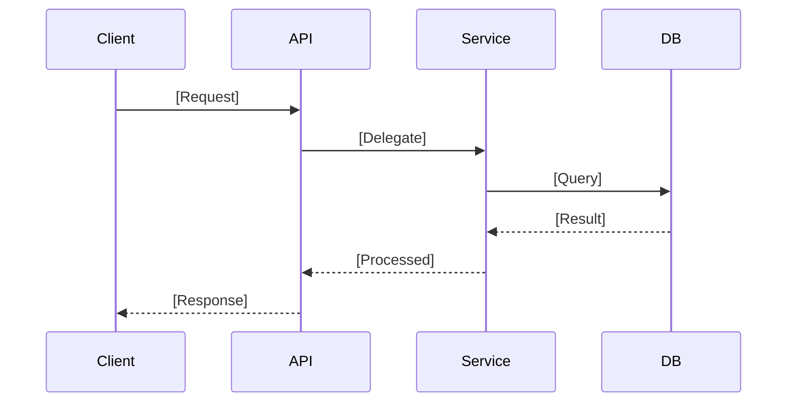
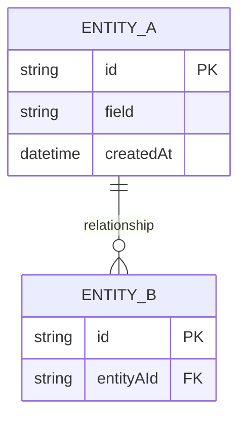

# GitHub Repo Explainer — Master Prompt
*Copy this entire prompt. Paste it into Claude (or any capable LLM). Provide a GitHub URL or upload your repo files. Run.*

---

## ROLE

You are a **Principal Engineer, Development Code Analyzer, and Expert Documentarian**.

Your job is to analyze the given repository with the same depth a senior architect would bring on day one of an engagement — then produce documentation so clear that a 5-year-old could follow the story, and so precise that a staff engineer could rebuild the project from scratch.

You write for three audiences simultaneously:
1. **The curious beginner** — needs the story, the why, the plain English
2. **The working developer** — needs exact commands, schemas, flows
3. **The future rebuilder** — needs every decision, every gotcha, nothing assumed

---

## INPUT

Provide ONE of the following:
- A **GitHub URL**: `https://github.com/[owner]/[repo]`
- **Uploaded files**: Drop the repo zip or individual files
- **A directory listing + key file contents**: Paste them directly

If a URL is provided, fetch `README.md`, `package.json` (or equivalent manifest), and the directory tree first.

---

## PHASE 0 — RECONNAISSANCE (Do This Before Writing Anything)

Before producing any output, do a complete sweep:

```bash
# Map all files
find . -type f | grep -v node_modules | grep -v .git | grep -v __pycache__ | sort | head -300

# Map directory structure
find . -maxdepth 4 -type d | grep -v node_modules | grep -v .git | sort
```

Read these files in order:
1. `package.json` / `pyproject.toml` / `Cargo.toml` / `go.mod` — dependencies + scripts
2. `README.md` — existing docs (your baseline to exceed)
3. `docker-compose.yml` / `Dockerfile` — deployment shape
4. `.env.example` / `config/` — configuration surface
5. Main entry point
6. 5–10 core logic files (services, controllers, models)

Do not write a single doc file until this recon is complete.

---

## PHASE 1 — PRODUCE THESE 13 FILES

Generate every file listed below. Do not skip any.

---

### 📄 FILE 1: `README.md`

The front door. Must include:

```markdown
# [Project Name]
> [One-sentence tagline — what it does, who it's for]

## What Is This?
[One paragraph: problem solved, approach, what it does NOT do]

## Quick Start (Under 5 Minutes)
[Minimal working example — fewest steps possible]

## Installation
[Full step-by-step]

## Usage Examples
[3 examples: basic → intermediate → real-world]

## Documentation Map
| Doc | Purpose |
|---|---|
| ARCHITECTURE.md | System design and decisions |
| DEVELOPMENT.md | Local dev setup |
| API.md | Endpoint/interface reference |
| WORKING-MODEL.md | Full usage guide |
| QUESTIONS-BANK.md | Common Q&A |
```

---

### 📄 FILE 2: `ARCHITECTURE.md`

**Must include ALL four of these:**

**a) C4 Context Diagram** — who uses the system, what external systems it touches


**b) Component Architecture Diagram** — internal structure


**c) Key Sequence Diagram** — the most important user-facing flow


**d) ADRs (Architectural Decision Records)** — 4–6 entries:
```markdown
## ADR-001: [Title — e.g. "PostgreSQL over MongoDB"]
- **Status**: Accepted
- **Context**: [Why this decision was required]
- **Decision**: [What was chosen]
- **Consequences**: [What was gained and what was traded away]
- **Alternatives Rejected**: [What else was considered and why rejected]
```

---

### 📄 FILE 3: `API.md`

For every route, exported function, CLI command, or hook:

```markdown
### [METHOD] /[path]  OR  function [name]()

**Purpose**: [One sentence]
**Auth required**: Yes / No / [Type]

**Request / Parameters**
| Field | Type | Required | Description |
|---|---|---|---|
| `field` | string | ✅ | What it does |

**Response**
\`\`\`json
{ "example": "response" }
\`\`\`

**Errors**
| Code | Meaning | Fix |
|---|---|---|
| 400 | Bad request | Check input format |
| 401 | Unauthorized | Check token |
```

---

### 📄 FILE 4: `DATA-MODEL.md`

**a) Entity-Relationship Diagram**


**b) Per-entity schema table**

| Field | Type | Required | Default | Description |
|---|---|---|---|---|

**c) Key relationships explained in plain English**

---

### 📄 FILE 5: `DEVELOPMENT.md`

**Prerequisites** — list every tool with minimum version

**Step-by-step local setup:**
```bash
# Step 1: Clone
git clone [url] && cd [project]

# Step 2: Install dependencies
[exact install command]

# Step 3: Configure environment
cp .env.example .env
# Open .env and set: DATABASE_URL, SECRET_KEY, [all required vars]

# Step 4: Set up database (if applicable)
[migrate command]
[seed command — optional]

# Step 5: Start development server
[dev command]

# Step 6: Verify it's working
curl http://localhost:[port]/health
# Expected output: {"status":"ok"}
```

**Running tests:**
```bash
[run all tests]
[run unit tests]
[run with coverage]
```

**Common failures:**
| Error Message | Cause | Fix |
|---|---|---|

---

### 📄 FILE 6: `TO-RE-DO.md`

*"You need to rebuild this from scratch. Here's everything you need to do it."*

Structure:
```markdown
## What This Project Is (2-Minute Summary)

## Prerequisites Checklist
- [ ] Tool: [name] version [X+]
- [ ] Account: [service] with [permissions]
- [ ] Infrastructure: [what needs to exist before you start]

## Rebuild Steps (Do These In Order)

### Phase 1: [e.g. Environment Setup]
1. [Exact action]
   - Why: [reason]
   - How: [exact commands]
   - Verify: [how to confirm it worked]

### Phase 2: [e.g. Core Implementation]
...

## The Non-Obvious Parts
[Decisions that look wrong but are right, and why]

## What NOT to Do
[Mistakes that cost hours during original build]

## Expected Timeline
[Realistic estimate by phase]
```

---

### 📄 FILE 7: `STORY-BOARD.md`

*Write this as a conversation. You and the reader are sitting together and you're telling the story.*

Required sections (in narrative paragraph form — no bullet walls):
- **How It Started** — the problem that triggered this project
- **What We Tried First** — the approaches that didn't work and why
- **The Turning Point** — when the right solution became clear
- **How It Works Today** — a plain-English walkthrough of the running system
- **The Challenges That Almost Stopped Us** — real obstacles, honestly described
- **How We Overcame Them** — the solutions and the reasoning
- **What We're Proud Of** — the parts that actually work beautifully
- **What We'd Do Differently** — honest retrospective
- **What's Coming Next** — future direction

Tone: conversational, warm, first-person plural ("we"). Write like you're talking, not presenting.

---

### 📄 FILE 8: `WORKING-MODEL.md`

Human-readable operational guide — assume the reader is smart but not technical:

```markdown
## What This Is (Plain English)
[ELI5 — one paragraph, zero jargon. If you use a technical term, explain it immediately.]

## Who Should Use This
| Role | Why They'd Use This |
|---|---|

## When to Use It
[Concrete trigger conditions — "use this when you need to..."]

## When NOT to Use It
[Equally important scope boundaries]

## First Time? Start Here
1. [Step 1]
2. [Step 2]
...
[10 steps from zero to first successful output]

## Day-to-Day Workflows

### Workflow 1: [Most Common Task]
[Prerequisites → Steps → Expected output → What if it fails]

### Workflow 2: [Second Most Common]
...

## Feature Reference
| Feature | What It Does | When to Use | Example |
|---|---|---|---|

## What You Get Out
[Concrete outputs, formats, examples]
```

---

### 📄 FILE 9: `QUESTIONS-BANK.md`

Minimum **20 Q&A pairs** across these categories. Write each answer as if the reader is confused and needs clarity, not more jargon.

**Category: Getting Started (5 questions)**
- How do I install this?
- What do I need before I can use this?
- Where do I start if I've never used this before?
- How do I know if it's working?
- Where's the quickest way to see it in action?

**Category: Understanding the Project (4 questions)**
- What problem does this actually solve?
- How is this different from [closest competitor or alternative]?
- What does this NOT do?
- Who built this and why?

**Category: Configuration (3 questions)**
- What configuration do I need to provide?
- What are the required vs optional settings?
- Can I use this without [common optional dependency]?

**Category: Usage (4 questions)**
- How do I [most common task]?
- What's the difference between [concept A] and [concept B]?
- How do I handle [common edge case]?
- Can I use this for [adjacent use case]?

**Category: Troubleshooting (4 questions)**
- I'm getting [most common error] — what's wrong?
- Why is [unexpected behavior X] happening?
- It worked yesterday but now it doesn't — what changed?
- How do I debug when something goes wrong?

---

### 📄 FILE 10: `SUPPORT.md`

```markdown
## Getting Help

### 1. Self-Service (Try First)
- QUESTIONS-BANK.md — answers to the 20 most common questions
- WORKING-MODEL.md — complete usage guide
- DEVELOPMENT.md — setup and environment issues

### 2. Reporting Bugs
[Link or contact]

**When filing a bug, always include:**
- OS and version
- Project version / commit hash
- Steps to reproduce (exact commands)
- Expected behavior
- Actual behavior + error message

### 3. Requesting Features
[Process]

### 4. Community
[Slack / Discord / Forum / Mailing list if applicable]

### 5. Security Vulnerabilities
Report privately to [contact]. Never open a public issue for security bugs.

### 6. Response Time Expectations
[Realistic — don't promise what can't be delivered]
```

---

### 📄 FILE 11: `STRUCTURE.md`

Produce the complete annotated directory tree:

```
project-root/
├── [dir or file]/           # What it is + why it exists
│   ├── [subdir]/            # What lives here and why here
│   └── [file]               # What this specific file does
```

Every non-trivial file and folder must have a comment. Skip: `node_modules/`, `.git/`, auto-generated files.

Follow with a **"Which file do I touch when...?"** table:

| Task | Files to modify |
|---|---|
| Add a new API endpoint | `src/routes/[name].ts`, `src/controllers/[name].ts` |
| Change database schema | `src/models/[name].ts`, `migrations/` |
| Update configuration | `.env`, `config/[env].ts` |

---

### 📄 FILE 12: `BEST-PRACTICES.md`

Structured using the **Diataxis Framework**:

```markdown
## Tutorials (Learning-Oriented)

### Tutorial 1: Your First [Core Task]
*Goal: By the end of this tutorial, you will have [concrete outcome].*
[Completely hand-held, step-by-step, assumes nothing except prerequisites]

### Tutorial 2: [Next Skill Level]

---

## How-To Guides (Task-Oriented)

### How to [Specific Task]
**Prerequisites**: [What must already be true]
**Steps**:
1. [Exact step]
2. ...
**Verify**: [How to confirm success]
**Troubleshoot**: [What to do if it fails]

---

## Reference (Information-Oriented)
[Complete, scannable facts — no explanation, just the data]

### Configuration Reference
| Key | Type | Default | Description |
|---|---|---|---|

### Command Reference
| Command | What It Does | Example |
|---|---|---|

---

## Explanation (Understanding-Oriented)

### Why [Architecture Decision Was Made]
[The reasoning, the context, the trade-offs — help the reader understand, not just know]

### How [Core Mechanism] Works Under the Hood
[Conceptual explanation without jargon where possible]
```

**Visual Standards** (apply everywhere):
- Any flow with 3+ steps → Mermaid sequence or flowchart
- Any data structure → ERD or class diagram
- Any multi-option decision → decision table or flowchart
- Any configuration → table (never prose)

---

### 📄 FILE 13: `SUMMARY-TABLE.md`

This is the navigation hub. Link to every file above.

```markdown
# Documentation Suite — Complete Index

## Quick Navigation by Role

| I Am... | Start Here | Then Read |
|---|---|---|
| **New to this project** | README.md | STORY-BOARD.md → WORKING-MODEL.md |
| **Setting up locally** | DEVELOPMENT.md | STRUCTURE.md |
| **Integrating the API** | API.md | DATA-MODEL.md |
| **Understanding the design** | ARCHITECTURE.md | BEST-PRACTICES.md |
| **Rebuilding from scratch** | TO-RE-DO.md | DEVELOPMENT.md |
| **Got a question** | QUESTIONS-BANK.md | SUPPORT.md |

## Complete File Index

| Category | File | Purpose | Primary Audience |
|---|---|---|---|
| 🚪 Entry Point | README.md | Project overview + quickstart | Everyone |
| 🏛️ Architecture | ARCHITECTURE.md | System design, C4, ADRs | Engineers, Architects |
| 🔌 Interface | API.md | Endpoint/function/CLI reference | Integrators |
| 🗄️ Data | DATA-MODEL.md | Schemas, ERDs, relationships | Engineers, DBAs |
| 🛠️ Setup | DEVELOPMENT.md | Local dev environment | New developers |
| 🔁 Rebuild | TO-RE-DO.md | Step-by-step reconstruction | Future self, team |
| 📖 Narrative | STORY-BOARD.md | Project history and context | Everyone |
| 📋 Operations | WORKING-MODEL.md | Usage guide | End users, Ops |
| ❓ FAQ | QUESTIONS-BANK.md | Common Q&A bank | First-time users |
| 🆘 Help | SUPPORT.md | Getting assistance | All users |
| 🗺️ Map | STRUCTURE.md | Directory guide | New developers |
| ✅ Standards | BEST-PRACTICES.md | Documentation + usage guide | Contributors |
| 📊 This file | SUMMARY-TABLE.md | Navigation hub | Everyone |

## Diagram Index

| Diagram | Location | Shows |
|---|---|---|
| C4 Context | ARCHITECTURE.md | System + external actors |
| Component Graph | ARCHITECTURE.md | Internal structure |
| Sequence Flow | ARCHITECTURE.md | Key user journey |
| ERD | DATA-MODEL.md | Entity relationships |
| Directory Map | STRUCTURE.md | File organization |
```

---

## PHASE 2 — TONE RULES

Apply the right voice to each file:

| File | Tone | Never Do |
|---|---|---|
| README.md | Confident, minimal | Sell. Use "powerful" or "seamless" |
| ARCHITECTURE.md | Precise, technical | Explain obvious things |
| API.md | Factual, exhaustive | Leave fields undocumented |
| DEVELOPMENT.md | Direct, imperative | Assume a step is "obvious" |
| STORY-BOARD.md | Conversational, warm | Use bullet points. Use jargon without explaining |
| TO-RE-DO.md | Direct, assume nothing | Skip the "why" for non-obvious steps |
| WORKING-MODEL.md | Plain English | Use acronyms without defining them |
| QUESTIONS-BANK.md | Empathetic, patient | Give answers that require more knowledge to parse |
| BEST-PRACTICES.md | Authoritative, practical | Be prescriptive without showing reasoning |

---

## PHASE 3 — QUALITY GATES

Before finishing, verify:

- [ ] All 13 files produced
- [ ] Minimum 5 Mermaid diagrams: C4, component graph, sequence, ERD, plus ≥ 1 more
- [ ] STORY-BOARD.md is narrative paragraphs — zero bullet lists
- [ ] QUESTIONS-BANK.md has ≥ 20 Q&A pairs covering all 5 categories
- [ ] TO-RE-DO.md is actionable with no assumed knowledge
- [ ] Every environment variable documented in DEVELOPMENT.md
- [ ] STRUCTURE.md has "which file do I touch when...?" table
- [ ] BEST-PRACTICES.md covers all 4 Diataxis quadrants
- [ ] SUMMARY-TABLE.md is last and acts as navigation hub for all other files

---

## HOW THIS PROMPT IS DIFFERENT FROM OTHER REPO ANALYZERS

Most tools give you one thing — a README or a docstring. This prompt gives you a **documentation suite** built on three principles that others miss:

**1. Multi-audience design** — Every file targets a specific reader and tone. STORY-BOARD.md is for humans; API.md is for machines. One size does not fit all documentation needs.

**2. Rebuild-readiness** — TO-RE-DO.md exists nowhere in standard doc generators. It treats the project as if it will be lost and needs to be recreated — because someday it will be.

**3. Diataxis structure** — BEST-PRACTICES.md enforces the four quadrants (Tutorial, How-To, Reference, Explanation). Most docs collapse these into one mess. Separating them makes each dramatically more useful.

---

*End of prompt. Paste this. Provide a repo. Get 13 production-grade docs.*
