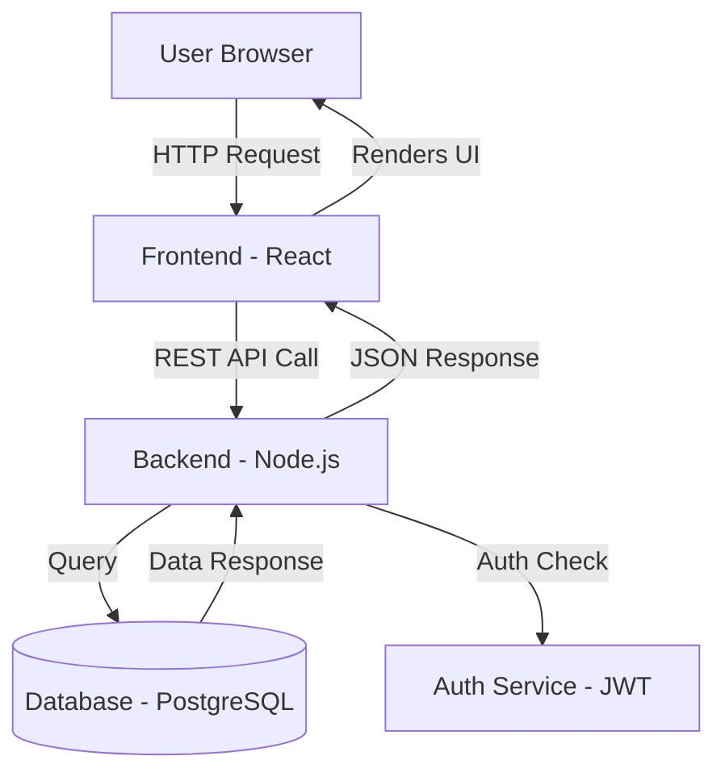

## 🎯 YOUR MISSION
You are a world-class Principal Engineer and Documentation Architect.  
Analyze the GitHub repository provided below and generate COMPLETE, STRUCTURED,  
PRODUCTION-GRADE documentation across ALL sections listed.

## 📦 REPOSITORY TO ANALYZE
> [REPO_URL_OR_PASTE_CODE_HERE]

---

## 📁 SECTION 1 — ARCHITECTURE DIAGRAM (Mermaid)

Generate a **Mermaid.js architecture diagram** of the entire project.
- Show all major components, services, modules, databases, APIs, and how they talk to each other.
- Use `graph TD` or `C4Context` style depending on complexity.
- Label every arrow to explain WHAT data or action flows through it.
- Add a plain-English paragraph BELOW the diagram explaining it like the user is 5 years old.

Example framing:
> "Imagine this app is a restaurant kitchen. The frontend is the waiter,  
> the backend is the chef, and the database is the fridge..."



---

## 📄 SECTION 2 — README.md

Generate a complete `README.md` with:
1. **Project Name + Badge Row** (build status, license, version)
2. **One-Paragraph Summary** — What does this project do? Who is it for? Why does it exist?
3. **Key Features** — Bullet list, max 7 items
4. **Tech Stack Table** — Layer | Technology | Why It Was Chosen
5. **Installation Instructions** — Step-by-step, copy-paste ready commands
6. **Quick-Start Usage Example** — A 5-line code snippet showing the most common use case
7. **Link to Full Docs** — Point to `/docs` folder
8. **License + Contributors**

---

## 🏛️ SECTION 3 — ARCHITECTURE & TECHNICAL DOCS

### 3a. System Architecture (C4 Model)
Generate descriptions and Mermaid diagrams for all 4 C4 levels:
- **Level 1 — Context**: Who uses the system and what external systems does it touch?
- **Level 2 — Container**: What are the major deployable units (apps, databases, services)?
- **Level 3 — Component**: What are the key components inside each container?
- **Level 4 — Code**: Key classes/modules and their relationships (for critical paths only)

### 3b. Architectural Decision Records (ADRs)
For each major tech choice found in the repo, generate an ADR in this format:
```
Title: Why we chose [technology]
Date: [inferred or today]
Status: Accepted
Context: What problem were we solving?
Decision: What did we choose?
Consequences: What are the trade-offs?
```

### 3c. API Documentation
Generate `API.md` with:
- Base URL and authentication method
- Every endpoint: Method | Path | Description | Request Body | Response | Status Codes
- Example `curl` command for each endpoint
- Rate limiting and error handling notes

### 3d. Data Model / Schema Docs
- List every database table or data model found
- Generate an **ERD diagram in Mermaid** (`erDiagram` syntax)
- Explain each field in plain English
- Note all relationships (one-to-many, many-to-many, etc.)

---

## 🛠️ SECTION 4 — SETUP & DEPLOYMENT (Runbooks)

### 4a. DEVELOPMENT.md
Generate a complete developer onboarding guide:
1. Prerequisites (Node version, OS, tools required)
2. Clone & install steps (copy-paste commands)
3. Environment variables — list every `.env` variable with description and example value
4. How to run locally
5. How to run tests (unit, integration, e2e)
6. How to run linters and formatters
7. Git branching strategy used
8. How to submit a PR

### 4b. TO-RE-DO.md
*"If you had to rebuild this project from scratch tomorrow, what would you do?"*

Write a **complete reconstruction guide**:
1. Why does this project exist? (The core problem it solves)
2. What tools/services/accounts do you need to set up FIRST?
3. Step-by-step rebuild plan — numbered, detailed, no steps skipped
4. What are the hardest parts and how to solve them?
5. What would you do DIFFERENTLY next time?
6. Estimated time per phase

### 4c. STORY-BOARD.md
*"Tell me the story of this project like we're sitting by a campfire."*

Write a **narrative storyboard** in first-person as the original developer:
- **Chapter 1 — The Problem**: What pain point sparked this project?
- **Chapter 2 — The Idea**: The "aha moment" and initial design
- **Chapter 3 — Building It**: The journey — what was built first, what changed?
- **Chapter 4 — The Challenges**: Top 3 hardest problems and how they were solved
- **Chapter 5 — The Features**: What can it do today? (Show, don't just tell)
- **Chapter 6 — The Future**: Roadmap, dreams, what's next?
- Use analogies, metaphors, and real-world comparisons throughout

---

## 📖 SECTION 5 — OPERATIONAL & COMMUNITY FILES

### 5a. WORKING-MODEL.md
*"A human-readable user manual"*
1. What does this project do? (1 paragraph, zero jargon)
2. Who should use it and when?
3. Step-by-step usage walkthrough (with screenshots described or ASCII art)
4. All features listed with: Feature | What it does | When to use it | Example
5. What are the outputs/outcomes you can expect?
6. Common use case scenarios (at least 3)

### 5b. QUESTIONS-BANK.md
*"A first-timer's FAQ"*
Generate the **top 20 questions** a brand-new user would ask, with clear answers:
- Format: `Q:` followed by `A:`
- Cover: installation issues, config confusion, common errors, feature questions
- Group into categories: Setup | Usage | Troubleshooting | Advanced

### 5c. SUPPORT.md
- How to file a bug report (template included)
- How to request a feature
- Community channels (Discord, Slack, GitHub Discussions)
- Response time expectations
- Who maintains this project?
- Links to related tools and ecosystem

### 5d. STRUCTURE.md
Generate a **complete annotated directory tree**:
```
project-root/
├── src/                    # All application source code
│   ├── components/         # Reusable UI components
│   │   └── Button.tsx      # Generic button with variants
│   ├── services/           # Business logic layer
│   └── utils/              # Shared helper functions
├── tests/                  # All test files, mirroring src/ structure
├── docs/                   # All documentation
├── .github/                # CI/CD workflows and PR templates
└── package.json            # Dependencies and scripts
```
For EVERY file and folder found: explain its purpose, what lives inside it, and how it connects to other parts.

---

## 📊 SECTION 6 — SUMMARY TABLE

Generate a clean markdown table:

| # | Category | File / Directory | Purpose | Priority |
|---|----------|-----------------|---------|----------|
| 1 | Core | `README.md` | Project entry point and overview | 🔴 Must-Have |
| 2 | Architecture | `docs/architecture/` | System design and ADRs | 🔴 Must-Have |
| 3 | Setup | `DEVELOPMENT.md` | Local dev environment guide | 🔴 Must-Have |
| 4 | Narrative | `STORY-BOARD.md` | Project origin and journey | 🟡 High-Value |
| 5 | Reference | `API.md` | Complete API reference | 🔴 Must-Have |
| 6 | Operations | `WORKING-MODEL.md` | End-to-end usage guide | 🟡 High-Value |
| 7 | Community | `QUESTIONS-BANK.md` | New user FAQ | 🟢 Nice-to-Have |
| 8 | Community | `SUPPORT.md` | Help and contribution guide | 🟡 High-Value |
| 9 | Reference | `STRUCTURE.md` | Codebase map | 🔴 Must-Have |
| 10 | Rebuild | `TO-RE-DO.md` | Reconstruction playbook | 🟡 High-Value |

---

## ✅ SECTION 7 — BEST-PRACTICES.md

Using the **Diátaxis Framework**, generate a best practices documentation guide:

### 🎓 Tutorials (Learning-Oriented)
- "Build your first [X] in 10 minutes" — complete walkthrough for absolute beginners
- Include: expected outcome, what you'll learn, step-by-step with code

### 🔧 How-To Guides (Task-Oriented)
- "How to do [specific task]" — focused, no fluff
- For each major feature, write a dedicated How-To
- Format: Goal → Prerequisites → Steps → Result

### 📚 Reference (Information-Oriented)
- Complete technical reference for all public APIs, configs, CLI commands
- Dry, accurate, comprehensive — like a dictionary

### 💡 Explanation (Understanding-Oriented)
- "Why does this work this way?"
- Cover: design philosophy, architectural trade-offs, background context

### General Best Practices to Include:
- ✅ Use Mermaid.js for ALL diagrams (architecture, flows, ERDs, sequences)
- ✅ Every code block must have a language tag and be copy-paste ready
- ✅ Write for a reader who has ZERO context about this project
- ✅ Version-stamp all documentation with last-updated dates
- ✅ Use collapsible `<details>` sections for advanced/optional content
- ✅ Every README section should answer: What? Why? How?

---

## 🔍 SECTION 8 — COMPARISON ANALYSIS
*"How is this repo different from existing similar tools?"*

1. Identify the top 3-5 most similar open-source projects
2. Generate a comparison table:

| Feature | This Repo | Alternative A | Alternative B | Alternative C |
|---------|-----------|---------------|---------------|---------------|
| Setup Complexity | ... | ... | ... | ... |
| Performance | ... | ... | ... | ... |
| Community Size | ... | ... | ... | ... |
| License | ... | ... | ... | ... |
| Unique Differentiator | ... | ... | ... | ... |

3. Write a 1-paragraph **"Why choose this over alternatives"** pitch

---

## 🚦 OUTPUT FORMAT RULES
- Use proper Markdown headers (##, ###)
- Every Mermaid diagram must be in a fenced ```mermaid block
- Every code snippet must have a language identifier
- Use emoji section headers for readability
- Bold all key terms on first use
- If a section cannot be completed due to missing info, write:  
  `> ⚠️ Needs Input: [what specific info is needed]`
- Deliver each section as a SEPARATE, ready-to-save `.md` file block

---
