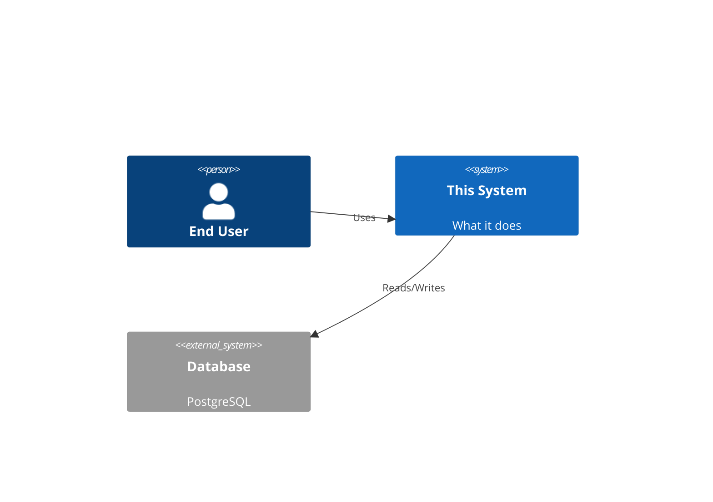
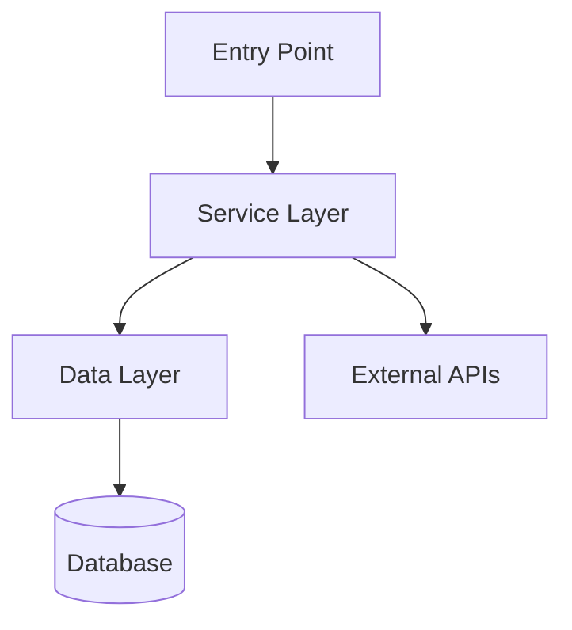
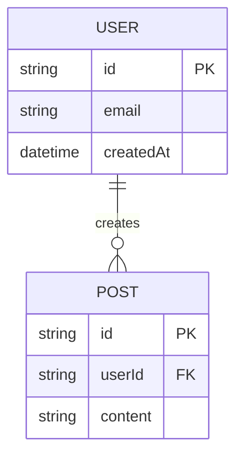

# Repo Explainer Skill

Produce a **complete documentation suite** for any codebase — far beyond what any README generator delivers.

---

## Phase 0 — Reconnaissance (Do This First, Every Time)

### 0.1 — Map the filesystem

```bash
find . -type f | grep -v node_modules | grep -v .git | grep -v __pycache__ \
  | grep -v ".pyc" | grep -v dist | grep -v ".next" | sort | head -300

find . -maxdepth 4 -type d | grep -v node_modules | grep -v .git | sort
```

### 0.2 — Read discovery files in this order

1. `package.json` / `pyproject.toml` / `Cargo.toml` / `go.mod` / `pom.xml`
2. Existing `README.md` / `README.rst` — baseline to exceed
3. `docker-compose.yml` / `Dockerfile` / `k8s/` — deployment shape
4. `.env.example` / `config/` — configuration surface area
5. Main entry point (see §0.3)
6. `ARCHITECTURE.md`, `CONTRIBUTING.md`, `CHANGELOG.md` if present

### 0.3 — Find the entry point

| Stack | Look for |
|---|---|
| Node.js | `main` in package.json |
| Python | `__main__.py`, `app.py`, `main.py`, `cli.py` |
| Go | `cmd/main.go` |
| Rust | `src/main.rs` |
| React/Next.js | `src/App.*`, `app/page.tsx` |
| Ruby/Rails | `config/routes.rb` + `app/` |

### 0.4 — Read 5–10 core files

Entry point → core services/controllers → main config → most-imported utilities.

---

## Phase 1 — Output Files to Produce

Generate **all files below**. Save each to the output filesystem. Do not skip any.

---

### FILE 1: `README.md`

```markdown
# [Project Name]
> [One-sentence tagline]

[One-paragraph summary: what it does, who it's for, what problem it solves.]

## Quick Start
[Minimal steps to go from zero to running in under 5 minutes]

## Installation
[Step-by-step with exact commands]

## Usage Examples
[3 copy-paste examples — basic, intermediate, real-world]

## Documentation
- [ARCHITECTURE.md] — System design
- [DEVELOPMENT.md] — Local dev setup
- [API.md] — Endpoint reference
- [WORKING-MODEL.md] — How to use it
- [Full docs index →](docs/)
```

---

### FILE 2: `ARCHITECTURE.md`

Include ALL of the following:

**a) C4 Context Diagram** — system + external actors


**b) Component Architecture Diagram**


**c) Sequence Diagram** for the most important user flow

**d) ADRs (Architectural Decision Records)** — one entry per major decision:
```
## ADR-001: [Decision Title]
- **Date**: [inferred]
- **Status**: Accepted
- **Context**: [Why this decision was needed]
- **Decision**: [What was chosen]
- **Consequences**: [Trade-offs accepted]
- **Alternatives Rejected**: [What else was considered]
```
Aim for 4–6 ADRs inferred from codebase patterns.

---

### FILE 3: `API.md`

For each route/endpoint discovered:
```
### POST /api/v1/[resource]

**Auth**: Bearer token / API key / None

**Request**
\`\`\`json
{
  "field": "type — description"
}
\`\`\`

**Response 200**
\`\`\`json
{
  "id": "string",
  "createdAt": "ISO8601"
}
\`\`\`

**Error Codes**
| Code | Meaning |
|---|---|
| 400 | Validation failed |
| 401 | Auth missing/invalid |
| 404 | Resource not found |
```

If no API exists, document the public interface (exported functions, CLI commands, hooks).

---

### FILE 4: `DATA-MODEL.md`

**a) Entity-Relationship Diagram**


**b) Schema table per entity**

| Field | Type | Required | Description |
|---|---|---|---|
| `id` | UUID | ✅ | Primary key |
| `email` | string | ✅ | Must be unique |

---

### FILE 5: `DEVELOPMENT.md`

**Prerequisites** (with exact minimum versions)

**Step-by-step local setup**
```bash
# 1. Clone
git clone [url] && cd [project]

# 2. Install deps
[install command]

# 3. Configure
cp .env.example .env
# Required vars: DATABASE_URL, API_KEY, SECRET_KEY

# 4. Migrate database (if applicable)
[migrate command]

# 5. Run dev server
[dev command]

# 6. Verify
curl http://localhost:[port]/health
```

**Running tests**
```bash
[test command]           # all tests
[test:unit command]      # unit only
[test:coverage command]  # with coverage report
```

**Common setup failures**

| Error | Cause | Fix |
|---|---|---|
| [Inferred from config] | ... | ... |

**Linting & formatting**
```bash
[lint command]
[format command]
```

---

### FILE 6: `TO-RE-DO.md`

*"You need to rebuild this from scratch tomorrow. Here's everything you need."*

```markdown
## What This Project Is
[3 sentences: the problem it solves, the approach, the tech stack]

## What You'll Need Before Starting
- [ ] [Tool 1] version [X]
- [ ] [Account/credential 1]
- [ ] [Infrastructure 1]

## Step-by-Step Rebuild Guide

### Step 1: [First thing to do]
[Why] + [How] + [Verify it worked]

### Step 2: ...
[Continue until project is fully operational]

## The Tricky Parts
[List the non-obvious decisions, gotchas, and the reasoning behind them]

## What NOT to Do (Lessons Learned)
[Mistakes that wasted time during original build]

## Time Estimate
[Realistic breakdown by phase]
```

---

### FILE 7: `STORY-BOARD.md`

*Write this as a conversation — you're explaining the project to a colleague over coffee.*

```markdown
# The Story of [Project Name]

## How It Started
"So here's the thing — we had this problem where..."

## What We Tried First (And Why It Didn't Work)
...

## The Breakthrough
"Then we realized..."

## How It Works Today
"Here's what happens when you..."

## The Challenges That Almost Stopped Us
...

## How We Overcame Them
...

## What We're Proud Of
...

## What We'd Do Differently
...

## What's Coming Next
...
```

Keep tone conversational. Use "we" and "you". No bullet walls — write in paragraphs.

---

### FILE 8: `WORKING-MODEL.md`

Human-readable operational guide:

```markdown
## What This Is (Plain English)
[ELI5 explanation — one paragraph, zero jargon]

## Who Should Use This
[Roles and why each role benefits]

## When to Use It
[Trigger conditions and use cases]

## When NOT to Use It
[Scope boundaries — equally important]

## First Time? Start Here
[Numbered steps 1-10, from zero to first successful output]

## Day-to-Day Usage
[The most common workflows with examples]

## Features
| Feature | What It Does | When to Use |
|---|---|---|

## Outcomes You Can Expect
[Concrete outputs with examples]
```

---

### FILE 9: `QUESTIONS-BANK.md`

Format: Q&A pairs. Minimum 20 questions across these categories:

**Getting Started**
- Q: How do I install this?
- A: [Exact answer]

**Understanding the Project**
- Q: What problem does this solve?
- Q: How is it different from [closest competitor]?

**Configuration**
- Q: What environment variables do I need?
- Q: Can I use this without [optional dependency]?

**Usage**
- Q: How do I [most common task]?
- Q: What's the difference between [concept A] and [concept B]?

**Troubleshooting**
- Q: I'm getting [common error] — what's wrong?
- Q: Why is [behavior X] happening?

**Contributing**
- Q: How do I add a new [feature type]?
- Q: How do I run the tests?

---

### FILE 10: `SUPPORT.md`

```markdown
## Getting Help

### Self-Service (Try First)
- [QUESTIONS-BANK.md] — answers to the 20 most common questions
- [WORKING-MODEL.md] — full usage guide
- [DEVELOPMENT.md] — setup issues

### Reporting Bugs
[Link to issue tracker or contact]
Include: OS, version, steps to reproduce, expected vs actual behavior.

### Requesting Features
[Process for feature requests]

### Community
[Any relevant Slack/Discord/forum/mailing list]

### Security Issues
[How to report vulnerabilities responsibly — never via public issues]
```

---

### FILE 11: `STRUCTURE.md`

```
project-root/
├── src/                    # [What lives here and why]
│   ├── controllers/        # [Purpose + relationship to services]
│   ├── services/           # [Core business logic — the heart]
│   ├── models/             # [Data shapes + DB interaction]
│   └── utils/              # [Shared helpers, no business logic]
├── tests/                  # [Test strategy — mirrors src/]
│   ├── unit/               # [Fast, isolated, no I/O]
│   └── integration/        # [Requires DB/external services]
├── config/                 # [Environment-specific config]
├── docs/                   # [Extended documentation]
├── scripts/                # [Dev/deploy automation]
├── Dockerfile              # [Multi-stage build]
├── docker-compose.yml      # [Local service orchestration]
├── .env.example            # [Template — copy to .env, never commit .env]
└── [Every other file]      # [Explained]
```

Include: how files interrelate, which files you touch for which task, what never to edit manually.

---

### FILE 12: `BEST-PRACTICES.md`

**Diataxis Framework sections** (required):

```markdown
## Tutorials (Learn by Doing)
### Tutorial 1: Your First [Core Task]
[Step-by-step, hand-held, assumes nothing]

### Tutorial 2: [Next milestone]

## How-To Guides (Goal-Oriented)
### How to [specific task]
[Prerequisites → Steps → Verify → Troubleshoot]

## Reference
### [Function/Command/Config] Reference
[Complete, scannable, no explanation — just facts]

## Explanation (Conceptual)
### Why [Architecture Decision]
### How [Core Mechanism] Works Under the Hood
```

**Visual Standards**
- Every concept that has a flow → Mermaid sequence or flowchart
- Every data structure → ERD or class diagram
- Every setup → numbered steps with `code blocks`
- Every configuration option → table

---

### FILE 13: `SUMMARY-TABLE.md`

```markdown
# Documentation Index

| Category | File | Purpose | Audience |
|---|---|---|---|
| Core | README.md | Project overview + quickstart | Everyone |
| Architecture | ARCHITECTURE.md | System design + ADRs | Engineers, Architects |
| API | API.md | Endpoint/interface reference | Integrators, FE devs |
| Data | DATA-MODEL.md | Schema + ERDs | Engineers, DBAs |
| Setup | DEVELOPMENT.md | Local dev environment | New developers |
| Rebuild | TO-RE-DO.md | Step-by-step reconstruction guide | Future self, team |
| Narrative | STORY-BOARD.md | Project history and context | Everyone |
| Operations | WORKING-MODEL.md | Usage guide | End users, Ops |
| FAQ | QUESTIONS-BANK.md | Common Q&A | First-time users |
| Help | SUPPORT.md | Getting help | All users |
| Map | STRUCTURE.md | Directory guide | New developers |
| Standards | BEST-PRACTICES.md | Doc + usage guidelines | Contributors |
```

---

## Phase 2 — Output Rules

### Save all files
```bash
# Save each file to output directory
# README.md → project root
# All others → docs/ or project root depending on convention detected
```

### Diagrams
- Every Mermaid block must be fenced with ```mermaid
- Minimum diagrams required: C4 context, component graph, sequence, ERD, directory/flow

### Tone Rules
- **ARCHITECTURE.md, API.md, DATA-MODEL.md**: Precise, technical, no fluff
- **STORY-BOARD.md**: Conversational, warm, first-person, narrative
- **TO-RE-DO.md**: Direct, imperative, assume nothing
- **QUESTIONS-BANK.md**: Empathetic — write as if the reader is confused and frustrated
- **WORKING-MODEL.md**: Plain English — imagine explaining to a smart non-developer
- **README.md**: Confident, minimal, never sells — just shows

### Quality gates — check before finishing
- [ ] All 13 files produced
- [ ] Minimum 5 Mermaid diagrams (C4, component, sequence, ERD, + 1 more)
- [ ] STORY-BOARD.md written in narrative paragraphs (not bullets)
- [ ] QUESTIONS-BANK.md has ≥ 20 Q&A pairs
- [ ] TO-RE-DO.md is actionable enough that someone could rebuild with no other context
- [ ] Every config variable documented in DEVELOPMENT.md
- [ ] SUMMARY-TABLE.md is the last file, acts as a navigation hub

---

## Phase 3 — Edge Cases

### If given a GitHub URL (no local files)
Use web_fetch to retrieve:
- `https://raw.githubusercontent.com/[owner]/[repo]/main/README.md`
- `https://raw.githubusercontent.com/[owner]/[repo]/main/package.json`
- GitHub API: `https://api.github.com/repos/[owner]/[repo]/contents/`
Infer as much as possible from public metadata + file tree.

### Monorepo
- One master ARCHITECTURE.md covering all packages
- Per-package: mini README + API.md only
- STRUCTURE.md shows full tree with package roles labeled

### Very small repos (< 5 files)
Compress: combine FILES 1+2, combine FILES 8+9. Keep all diagrams. Keep STORY-BOARD.md.

### Very large repos (50+ files)
- STRUCTURE.md covers top-level only; note subdirectory READMEs
- QUESTIONS-BANK.md expands to 30+ questions
- API.md documents top 10 most-used endpoints only; note where full spec lives

---

## Skill Notes

- Present all files using `present_files` tool after creation
- End with: *"Documentation suite complete. Files most likely to need expansion: [2–3 specific suggestions based on what you found in the repo]."*
- If no repo is provided yet, ask for one before starting — do not generate fictional content