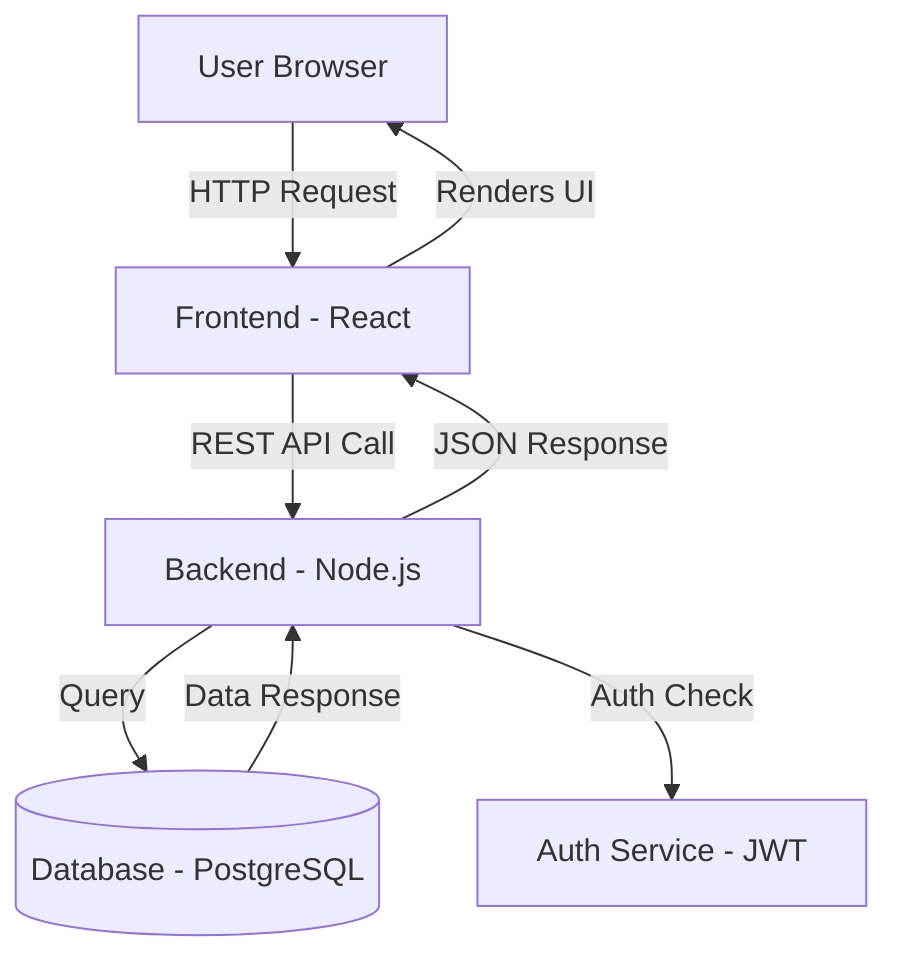

## 📁 SECTION 1 — ARCHITECTURE DIAGRAM (Mermaid)

Generate a **Mermaid.js architecture diagram** of the entire project.

- Show all major components, services, modules, databases, APIs, and how they talk to each other.
- Use `graph TD` or `C4Context` style depending on complexity.
- Label every arrow to explain WHAT data or action flows through it.
- Add a plain-English paragraph BELOW the diagram explaining it like the user is 5 years old.

Example framing:
> "Imagine this app is a restaurant kitchen. The frontend is the waiter,  
> the backend is the chef, and the database is the fridge..."

