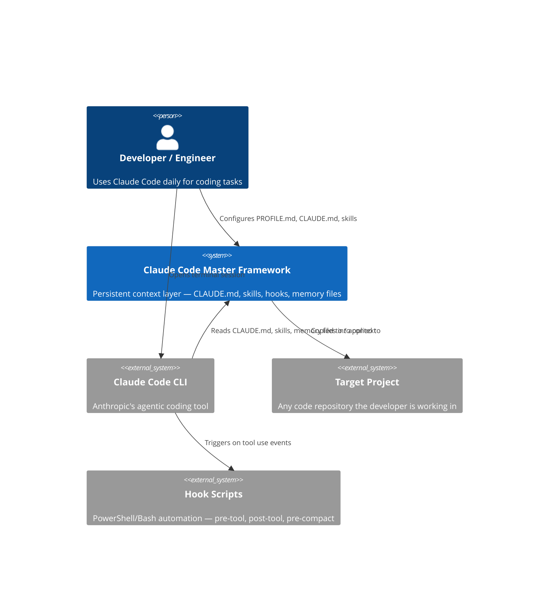
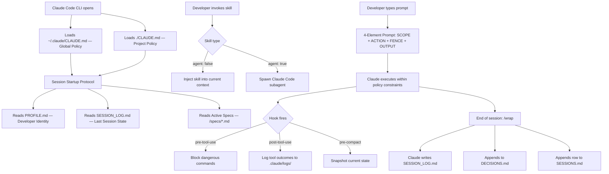
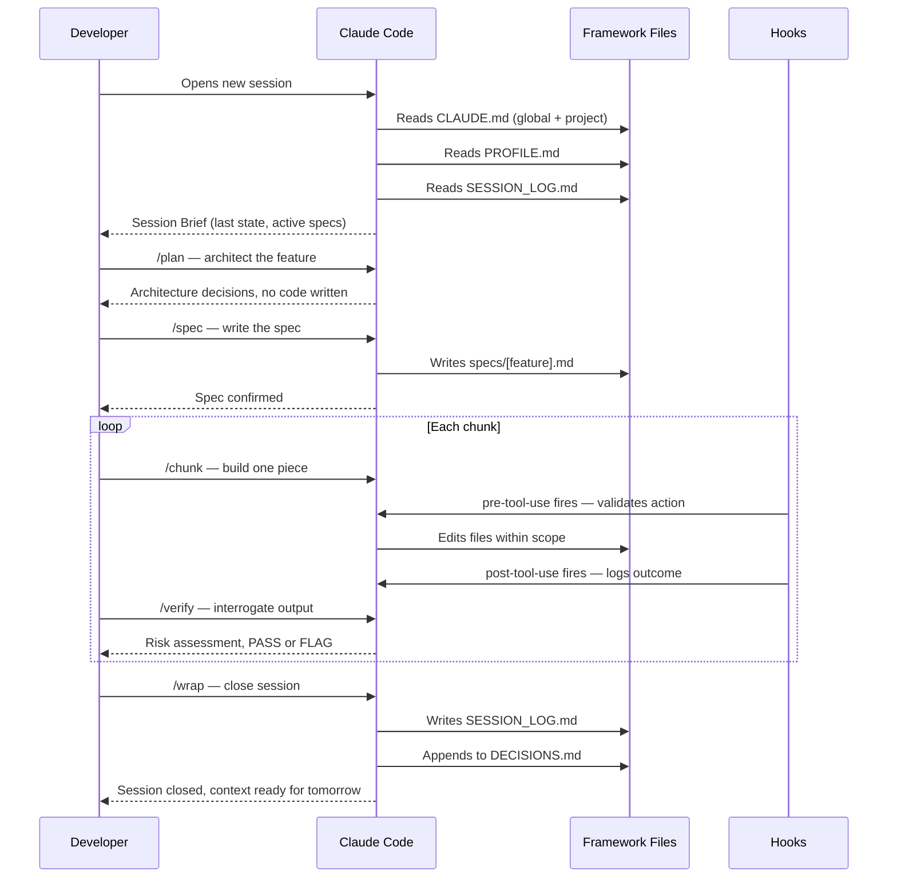

# ARCHITECTURE.md — Claude Code Master Framework

## Overview

The Claude Code Master Framework is a **file-based runtime layer** for Claude Code. It operates entirely through Claude's context window — no servers, no databases, no build steps. Its architecture is deliberately minimal: files are loaded, Claude reads them, behavior changes.

---

## C4 Context Diagram

---

## Component Architecture

---

## 5-Phase Development Sequence

---

## Architectural Decision Records

### ADR-001: File-Based Memory Over API/Database
- **Date**: March 2026
- **Status**: Accepted
- **Context**: Claude has no persistent memory between sessions. Options considered: external vector DB, Anthropic Projects feature, file-based text files.
- **Decision**: Three-file memory system (SCRATCHPAD.md, DECISIONS.md, SESSIONS.md) written to disk by Claude at session end.
- **Consequences**: Memory is durable, inspectable, and zero-cost. Requires discipline — developer must say "Close the session." every time.
- **Alternatives Rejected**: Vector DB (overkill for text summaries, adds infrastructure); Anthropic Projects (limited control over what gets stored).

---

### ADR-002: Skill Invocation by Name, Not Automation
- **Date**: March 2026
- **Status**: Accepted
- **Context**: Considered auto-loading all skills at session start vs. explicit invocation.
- **Decision**: Skills are invoked explicitly: `Use debug-first skill.` Each loads only when needed.
- **Consequences**: Zero token cost until skill is needed. Requires developer to remember skill names — mitigated by README skills quick-reference table.
- **Alternatives Rejected**: Auto-load all skills (would consume 5,000–15,000 tokens per session on skills not needed).

---

### ADR-003: Three Hook Points — Pre-Tool, Post-Tool, Pre-Compact
- **Date**: March 2026
- **Status**: Accepted
- **Context**: Needed automated safety enforcement that couldn't be bypassed by Claude's context drift.
- **Decision**: Three PowerShell hook scripts wired in `~/.claude/settings.json`. They fire at the Claude Code app layer — not in Claude's context — so CLAUDE.md rules can't override them.
- **Consequences**: `rm -rf`, `DROP TABLE`, `git push --force`, `.env` writes, and `npm install` are blocked at the app level regardless of what Claude wants to do.
- **Alternatives Rejected**: CLAUDE.md-only rules (Claude follows them but they are not enforced mechanically); no hooks (dangerous for agentic long-running sessions).

---

### ADR-004: Two Skill Directories — `skills/` and `.claude/skills/`
- **Date**: March 2026
- **Status**: Accepted
- **Context**: Some skills are universal (copy to every project); some are specific to this framework repo.
- **Decision**: `skills/` = template skills, copied to new projects via `framework-apply`. `.claude/skills/` = framework-repo-only skills (batch, simplify, problem-solver).
- **Consequences**: New projects only receive operational skills. Framework-level introspection skills don't pollute target projects.
- **Alternatives Rejected**: Single directory (would copy framework-management skills into unrelated projects).

---

### ADR-005: 5-Phase Protocol Enforced by Naming, Not Tooling
- **Date**: March 2026
- **Status**: Accepted
- **Context**: Phase gates (/plan, /spec, /chunk, /verify, /update) could have been implemented as Claude Code slash commands or hooks.
- **Decision**: Phases are defined in CLAUDE.md as behavioral rules. Developer invokes with natural language commands.
- **Consequences**: Zero tooling overhead. Any session inheriting CLAUDE.md gets the protocol. Risk: developer can skip phases — mitigated by explicit rule "Never build during /plan."
- **Alternatives Rejected**: Custom slash commands (requires CLI extension complexity); hook-enforced phases (hooks can't reason about semantic intent of a prompt).

---

### ADR-006: Windows-First Hook Paths with Unix Fallback
- **Date**: March 2026
- **Status**: Accepted
- **Context**: Framework author works on Windows. Hook scripts written as PowerShell `.ps1` with Bash equivalents.
- **Decision**: CLAUDE.md declares "Windows-first commands and script paths." `setup.ps1` / `setup.sh` are provided for both platforms.
- **Consequences**: Works natively on developer's machine. Unix teams must run `setup.sh` and verify hook paths.
- **Alternatives Rejected**: Unix-only (excludes the author's actual environment); cross-platform JS scripts (adds Node.js dependency to what should be a zero-dependency framework).
