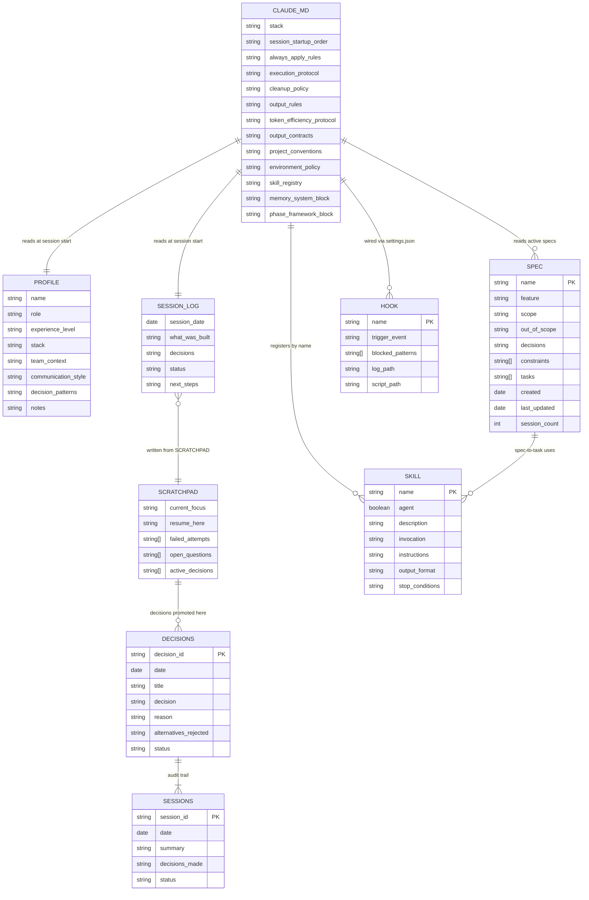

# DATA-MODEL.md — Framework Data Structures

This framework has no application database. Its "data model" is the schema of its **persistent markdown files** — the files Claude reads, writes, and updates to maintain state across sessions.

---

## Entity-Relationship Diagram

---

## Schema: PROFILE.md

| Field | Type | Required | Description |
|---|---|---|---|
| `name` | string | ✅ | Developer full name |
| `role` | string | ✅ | Job title (e.g., Tech Lead, Principal Engineer) |
| `experience_level` | string | ✅ | Self-assessed level (Beginner / Intermediate / Senior) |
| `stack` | string[] | ✅ | Technologies used daily |
| `team_context` | string | ✅ | Team name, methodology, constraints |
| `communication_style` | string | ✅ | Preferred response tone and ordering |
| `decision_patterns` | string[] | ✅ | Preferences: simple vs. clever, edit vs. create, etc. |
| `notes` | string | ❌ | Free-form context (e.g., "GraphQL is the API layer, not REST") |

---

## Schema: CLAUDE.md (Required Sections)

| Section | Required | Effect |
|---|---|---|
| `Stack` | ✅ | Sets tech context for every response |
| `Session Startup` | ✅ | Controls which files are read at open |
| `Session Closure` | ✅ | Defines what happens on "close the session" |
| `Always-Apply Rules` | ✅ | Hard behavioral constraints |
| `Execution Protocol` | ✅ | Plan-before-execute, scope discipline |
| `Output Rules` | ✅ | Format, length, token efficiency defaults |
| `Memory System` block | ✅ | Three-file memory schema (SCRATCHPAD, DECISIONS, SESSIONS) |
| `Phase Framework` block | ✅ | 5-phase protocol (/plan → /spec → /chunk → /verify → /update) |
| `Core Skills` | ✅ | Skill name ↔ file mapping |

---

## Schema: SCRATCHPAD.md

| Field | Type | When Updated |
|---|---|---|
| `Current Focus` | string | Every `/wrap` |
| `Resume Here` | string | Every `/wrap` — the next literal action to take |
| `Failed Attempts` | string[] | Appended on `/wrap` when something didn't work |
| `Open Questions` | string[] | Appended on `/wrap` when something is unresolved |
| `Active Decisions` | Decision[] | Appended on `/decide` or `/wrap` |

**Size limit:** If SCRATCHPAD.md exceeds 300 lines, Claude summarises old "Failed" entries before appending.

---

## Schema: DECISIONS.md Entry

| Field | Type | Required | Description |
|---|---|---|---|
| `decision_id` | string | ✅ | Format: DECISION-001, DECISION-002 |
| `date` | date | ✅ | ISO date of the decision |
| `title` | string | ✅ | Short name (e.g., "Use GraphQL over REST") |
| `decision` | string | ✅ | What was chosen |
| `reason` | string | ✅ | Why — the constraint or tradeoff |
| `alternatives_rejected` | string | ❌ | What else was considered |
| `status` | enum | ✅ | Accepted / Superseded / Deferred |

**Never truncated.** All entries persist. If a new decision contradicts an existing one, Claude flags it before writing.

---

## Schema: SPEC File (`specs/[name].md`)

| Field | Type | Required | Description |
|---|---|---|---|
| `feature` | string | ✅ | Feature name |
| `scope` | string[] | ✅ | Files and functions in scope |
| `out_of_scope` | string[] | ✅ | What must not be touched |
| `decisions` | string[] | ✅ | Locked architectural decisions for this feature |
| `constraints` | string[] | ✅ | Hard limits (tech, time, token budget) |
| `tasks` | checklist | ✅ | Ordered task list — one per /chunk |
| `created` | date | ✅ | When spec was written |
| `last_updated` | date | ✅ | Updated at each /chunk completion |
| `session_count` | int | ✅ | How many sessions touched this spec |

---

## Schema: SKILL File (`skills/[name].md`)

| Field | Type | Required | Description |
|---|---|---|---|
| `name` | string | ✅ | Skill identifier |
| `agent` | boolean | ✅ | false = inline; true = subagent spawn |
| `description` | string | ✅ | One-line purpose |
| `invocation` | string | ✅ | Exact phrase: `Use [name] skill.` |
| `instructions` | markdown | ✅ | Full behavioral instructions for Claude |
| `output_format` | string | ✅ | Expected output structure |
| `stop_conditions` | string[] | ❌ | Conditions where Claude stops and waits |

---

## Schema: Hook Script

| Field | Type | Description |
|---|---|---|
| `name` | string | Script filename |
| `trigger_event` | enum | `pre-tool-use`, `post-tool-use`, `pre-compact` |
| `blocked_patterns` | regex[] | Commands that trigger a block response |
| `log_path` | filepath | Where output is written |
| `script_path` | filepath | Absolute path in `settings.json` |
